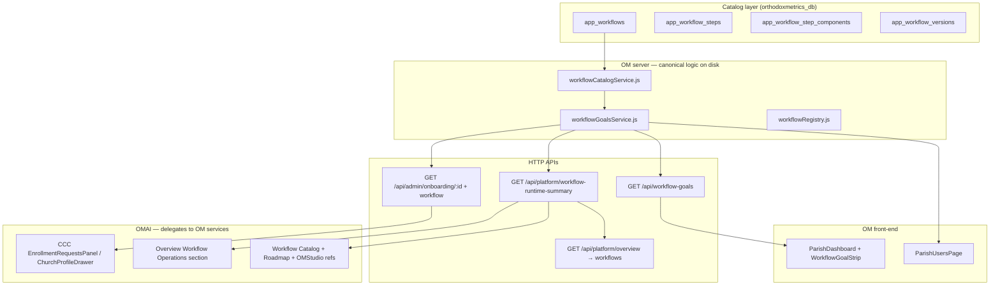

# App Workflow Catalog Pipeline — Development Log & North Star

**Last updated:** 2026-06-12  
**Owners:** OM backend (`orthodoxmetrics/prod`), OMAI control panel (`omai/berry`), shared catalog in `orthodoxmetrics_db`  
**Status:** Phase A hierarchy shipped — GLOBAL → APP_FAMILY → WORKFLOW_GROUP tree; 6/6 filed workflows  
**Implementation log:** [workflow-catalog-review-implementation.md](./workflow-catalog-review-implementation.md)  
**Architecture review:** [workflow-catalog-architecture-gap-analysis.md](./workflow-catalog-architecture-gap-analysis.md)  
**Phase A design:** [workflow-catalog-phase-a-hierarchy-design.md](./workflow-catalog-phase-a-hierarchy-design.md)

---

## 1. Goal we are headed towards

Build a **single, gap-free pipeline** for parish and platform workflows so that:

1. **Definitions** live in one canonical place: `app_workflows` and related tables in `orthodoxmetrics_db` (not parallel progress systems, not legacy `/workflows/*` APIs).
2. **Runtime resolvers** map live DB/state → catalog `step_key` → actionable deep links for parish staff and platform admins.
3. **Surfaces** consume the same source of truth:
   - OM parish UI (goal strip, parish hub)
   - OMAI Church Command Center (enrollment detail, church profile drawer)
   - OMAI Executive Overview (workflow KPIs)
   - OMAI Workflow Catalog (readiness, drift, runtime, governance)
4. **Adding workflow N+1** is a documented, repeatable process (DB seed + resolver + routes + optional UI) without introducing new gaps.
5. **Promotion loop** (Workshop → OMStudio approve → OM deploy) is auditable and eventually automatable.

**North star (from OMAI Workflow Roadmap):** Every filed workflow reaches **production_ready (100%)** in the catalog, runtime counters are live, drift is clear, and promotion from Workshop through OMStudio to OM is traceable in governance audit logs.

---

## 2. Architecture (current)



**Single source of truth on disk:** OMAI `_runtime/server` requires `workflowGoalsService.js` from `OM_PROD_ROOT` (`/var/www/orthodoxmetrics/prod/server/src/services/`) so resolver logic is not duplicated.

---

## 3. Work completed (chronological summary)

### 3.1 Foundation (pre-pipeline terminology & launcher)

| Work | Repos / commits | Notes |
|------|-----------------|-------|
| Onboarding phase labels (Staged, Provisioned, …) | OM `77e393f3`, OMAI `7a2ff3c` | Shared `onboardingPhases.ts` |
| OMAI IAM + CRM launcher entries | OMAI `77d1197` | IAM shell, CCC launcher |
| OMAI sidebar consolidation | OMAI `e952642` | Single Workflows item, redirects, logs canonical |

### 3.2 Phase 1 — OM parish goal strip

| Artifact | Path |
|----------|------|
| Catalog loader | `server/src/services/workflowCatalogService.js` |
| Goal resolver + registry | `server/src/services/workflowGoalsService.js` |
| Parish API | `server/src/routes/workflow-goals.js` → `GET /api/workflow-goals?church_id=` |
| UI | `front-end/.../WorkflowGoalStrip.tsx` on `ParishDashboard.tsx` |

**OM commit:** `c1ab2eaf` — deployed (`om-deploy.sh fe` + `be-sync`)

### 3.3 Phase 2 — CCC ↔ `church.enrollment`

| Artifact | Change |
|----------|--------|
| `GET /api/admin/onboarding/:id` | Returns `workflow` object + catalog-labeled `progress` |
| OMAI CCC | `EnrollmentRequestsPanel.tsx`, `ChurchProfileDrawer.tsx` |
| Shared types | `omai/berry/.../workflowGoals.ts` |

**OMAI commit:** `97562c7` — deployed (`omai-deploy.sh fe` + `be`)

### 3.4 Runtime resolvers for all 5 filed workflows

| Workflow key | Resolver trigger | Parish action route (examples) |
|--------------|------------------|-------------------------------|
| `church.enrollment` | `onboarding_requests` status | `/onboarding/change-password`, `/onboarding/record-tables`, … |
| `ocr.setup.wizard` | `ocr_setup_state` in church DB | `/devel/ocr-setup-wizard?church_id=` |
| `ocr.batch.review` | Open `ocr_jobs` by `review_status` | `/portal/ocr/review/:churchId/:jobId` |
| `identity.user.admin` | Locked users / low staff count | `/account/parish-management/users` |
| `records.certificate.generate` | Has records, zero `generated_certificates` | `/portal/certificates/generate` |

**OM commit:** `1d1783b8` — deployed (`be-sync`)

### 3.5 Executive KPIs & catalog runtime

| Artifact | Change |
|----------|--------|
| `getWorkflowRuntimeSummary()` | Per-workflow KPIs + totals + governance block |
| `GET /api/platform/workflow-runtime-summary` | OMAI platform API |
| `GET /api/platform/overview` | Includes `workflows` payload |
| Overview UI | `WorkflowOperationsSection.tsx` on Executive Overview |
| Catalog UI | Live KPI chips, expanded runtime drawer, “Needs attention” stat |

**OM:** `da5fd4ac` · **OMAI:** `a83d566` — deployed

### 3.6 Enrollment progress alignment

- `getProgressSteps()` in `onboardingService.js` delegates to catalog step keys via `getEnrollmentLegacyProgress()` (sync, no DB).
- Admin onboarding fallback maps `label` from catalog step names.

**OM:** `da5fd4ac`

### 3.7 Parish users page (identity workflow closure)

| Artifact | Change |
|----------|--------|
| `ParishUsersPage.tsx` | `/account/parish-management/users` |
| `church-users.js` | Parish staff can GET list + unlock; unlock clears `is_locked` + `is_active` |
| Nav | Dashboard + Users visible in parish management sidebar |
| Identity `STEP_ACTION_ROUTES` | Point to parish users page |

**OM:** `d4b83f46` — deployed (`fe` + `be-sync`)

### 3.8 Governance / Step 2 promotion loop (partial)

| Artifact | Change |
|----------|--------|
| `GET /api/platform/governance/deployment-audit` | Audit log list |
| `GET /api/platform/governance/pipeline-summary` | Pending/deployed/audit counts |
| Approve handler | Audit `target_workflow_key`, `syncWorkflowRefs`, `workflow_ref_sync` event |
| Roadmap auto-check | `s2-r1` (submitted request), `s2-r2` (deployed + deployment audit) |
| OMStudio refs UI | Promotion audit trail panel |

**OMAI:** `ec8e021` — deployed (`fe` + `be`)

### 3.9 Workflow filing registry

**File:** `server/src/services/workflowRegistry.js` — checklist + `FILED_WORKFLOW_KEYS` array.

---

## 4. Catalog DB (5 filed workflows)

**Migration seed:** `server/database/migrations/20260608_app_workflow_catalog.sql`

| workflow_key | completion_state (seed) | runtime_state_source |
|--------------|-------------------------|----------------------|
| `church.enrollment` | production | `onboarding_requests` |
| `ocr.batch.review` | near_complete | `ocr_jobs` |
| `ocr.setup.wizard` | near_complete | church DB `ocr_setup_state` |
| `records.certificate.generate` | near_complete | `generated_certificates` (optional) |
| `identity.user.admin` | mapped | `users` |

**Legacy retired:** `GET /api/workflows/*` → 410; use `/api/platform/workflow-catalog` and `/api/workflow-goals`.

---

## 5. API reference (workflow pipeline)

| Method | Path | Auth | Purpose |
|--------|------|------|---------|
| GET | `/api/workflow-goals?church_id=` | Parish roles | Actionable goals for parish dashboard strip |
| GET | `/api/admin/onboarding/:id` | Admin | Enrollment detail + `workflow` + `progress` |
| GET | `/api/platform/workflow-catalog` | OMAI admin | Catalog list |
| GET | `/api/platform/workflow-catalog/:key/runtime` | OMAI admin | Per-workflow runtime stats |
| GET | `/api/platform/workflow-runtime-summary` | OMAI admin | All-workflow KPI rollup |
| GET | `/api/platform/workflow-goals` | OMAI admin | Delegates to OM `getGoalsForChurch` |
| GET | `/api/platform/overview` | OMAI admin | Executive metrics incl. `workflows` |
| GET | `/api/platform/governance/deployment-requests` | OMAI admin | Workshop submission inbox |
| GET | `/api/platform/governance/deployment-audit` | OMAI admin | Promotion audit trail |
| POST | `/api/platform/governance/deployment-requests/:id/approve` | super_admin | Mark deployed + audit + sync refs |
| GET | `/api/admin/church-users/:churchId` | Platform admin or parish staff | Parish user directory |
| POST | `/api/admin/church-users/:churchId/:userId/unlock` | Platform admin or parish staff | Activate locked user |

---

## 6. UI touchpoints

| Surface | Route / location | Data source |
|---------|------------------|-------------|
| OM Parish Dashboard | `/account/parish-management` | `/api/workflow-goals` |
| OM Parish Users | `/account/parish-management/users` | `/api/admin/church-users/:id` |
| OMAI CCC Enrollment | `/cp/ops/church-command-center` → CRM → Enrollment | `/api/admin/onboarding/:id` |
| OMAI Church Profile Drawer | Enrollment tab | Same |
| OMAI Workflow Catalog | `/cp/executive/workflow-catalog` | `/api/platform/workflow-catalog`, runtime summary |
| OMAI Workflow Roadmap | `/cp/executive/workflow-roadmap` | localStorage + readiness + governance auto-checks |
| OMAI Executive Overview | `/cp/executive/overview` → Workflow Operations | `/api/platform/overview` → `workflows` |
| OMAI OMStudio refs | `/cp/omstudio/tools/workflow-references` | governance + refs APIs |

---

## 7. How to add workflow #6+ (no gaps)

From `workflowRegistry.js` and `workflowGoalsService.js` header:

1. File workflow in `app_workflows*` (migration or seed): steps, components, `route_entrypoints`.
2. Register resolver in `RUNTIME_RESOLVERS` in `workflowGoalsService.js`.
3. Add entries in `STEP_ACTION_ROUTES` for parish/admin deep links.
4. Extend `getRuntimeStatsForCatalog()` and `deriveWorkflowKpi()` for Overview/Catalog KPIs.
5. Optionally add UI hook (parish strip, CCC panel, or catalog-only).
6. Append key to `FILED_WORKFLOW_KEYS` in `workflowRegistry.js`.
7. Deploy OM `be-sync` (or `be` if TS), OMAI `be` if platform routes change, both `fe` if UI changes.
8. Run **Sync states** from OMAI Workflow Catalog; verify readiness/drift.

---

## 8. Roadmap phases (OMAI Workflows UI) — status

### Step 1 — Production-ready catalog (5/5)

- Catalog schema + 5 workflows seeded.
- Readiness/drift/runtime APIs exist.
- Auto roadmap checks for `s1-r1` … `s1-r7` when readiness matches.
- **Operator sign-off (`s1-r8`)** still manual checkbox.

### Step 2 — Promoting workflows (Workshop → OMStudio → OM)

| Item | Status |
|------|--------|
| `s2-r1` Workshop submit → inbox | Auto-check when submitted request exists |
| `s2-r2` Approve → deployed in governance log | Auto-check when deployed + deployment audit event |
| `s2-r3` full_version convention | Manual / process |
| `s2-o1` Physical package deploy to filesystem | **Not implemented** — DB status only today |
| `s2-o2` Per-target deployed version matrix | Not implemented |
| `s2-o3` Validation gates before promotion | Not implemented |
| `s2-o4` Rollback target on every deploy | Not implemented |

### Step 3 — Deliverables & governance

Mostly checklist items in Roadmap UI; canonical inventory and drift detection exist; full promotion audit trail partially exists.

---

## 9. Known gaps & technical debt

| Gap | Detail |
|-----|--------|
| OM FE does not host Workflow Catalog | By design — catalog is OMAI; OM only consumes goals API |
| CRM enrollment funnel vs catalog steps | CCC shows catalog steps in detail drawer; CRM funnel/KPI tiles may still be ad-hoc |
| `church_users` junction vs `users.church_id` | Identity resolver uses `users.church_id`; parish users page uses `church_users` — edge cases for multi-church users |
| `church-users` lock vs `is_locked` | Lock endpoint still sets `is_active`; unlock sets both `is_locked` and `is_active` — lock path may not set `is_locked` |
| Certificate mid-flow | No draft persistence; goal is “first certificate” nudge only |
| `PendingMembersPage` | Calls `/admin/users/:id/unlock` — route may not exist on server (unlock lives on `church-users`) |
| OCR setup scan in runtime summary | Iterates all active churches’ DBs — may be slow as parish count grows |
| Parish management sidebar | Most items still `hidden: true` by product decision (2026-05-30); only Dashboard, Users, Database Mapping, Record Settings visible |
| Legacy `getProgressSteps` | Fallback returns `[]` if catalog helper throws — rare |

---

## 10. Production context (from earlier sessions)

- **1 paid client:** Saints Peter & Paul, Manville (church #46, CRM #80)
- **~80 pre-onboarded** parishes in pipeline
- Manville linked to CRM lead #80 with `active_paid` / `billing_status: paid`

Useful for validating goal strip, enrollment resolver, and certificate/OCR goals against real data.

---

## 11. Deploy commands (reference)

```bash
# OM production (detached origin/main recommended)
cd /var/www/orthodoxmetrics/prod
git checkout --detach origin/main
/var/omai-ops/om-deploy.sh fe          # front-end
/var/omai-ops/om-deploy.sh be-sync     # JS-only server changes

# OMAI production
cd /var/www/omai
git fetch origin main && git checkout --detach origin/main
/var/omai-ops/omai-deploy.sh fe
/var/omai-ops/omai-deploy.sh be
```

**Recent pipeline commits:**

| Repo | Commit | Summary |
|------|--------|---------|
| OM | `d4b83f46` | Parish users + identity routes + registry |
| OM | `da5fd4ac` | Runtime summary + catalog-aligned progress |
| OM | `c1ab2eaf` | Phase 1–2 goals pipeline |
| OMAI | `ec8e021` | Governance audit + Step 2 auto-checks |
| OMAI | `a83d566` | Overview workflow KPIs |
| OMAI | `97562c7` | CCC catalog enrollment steps |

---

## 12. Open questions (need product / operator input)

**Canonical list:** [workflow-catalog-open-questions.md](./workflow-catalog-open-questions.md) — updated 2026-06-12 with resolved vs open items and answer templates.

**Do not treat any of the below as decided** unless marked resolved in the open-questions doc.

### Workflow catalog & scope

1. **Which workflow should be filed next as #6?** Roadmap mentions: manual entry, church setup, audit, and `church_ops` system level exists in migration. What is priority order?
2. **Should `church_ops` group workflows** (manual church setup) be separate from `church.enrollment` or merged into enrollment hybrid?
3. **Operator sign-off for Step 1 (`s1-r8`):** Who signs off and what evidence is required beyond automated readiness checks?
4. **Should we run `sync-production-states` on a schedule** or only manually after deploys?
5. **Overview Dashboard:** Replace one of the eight executive stat cards with a single “Workflow attention” card, or keep the dedicated Workflow Operations section only?

### Step 2 — Promotion loop (Workshop → OMStudio → OM)

6. **Physical package deploy (`s2-o1`):** Should approve copy artifacts to OM/OMAI/OMStudio filesystems, or remain DB-status-only for now?
7. **Automated governance triggers:** Should approve auto-trigger `om-deploy.sh` / `omai-deploy.sh` for `target_app`, or stay human-driven deploy after approve?
8. **Validation gates (`s2-o3`):** Required checks before approve — build pass, drift clear, hash match, preview URL?
9. **Per-target version matrix (`s2-o2`):** Where should deployed component versions be displayed (catalog detail, OMStudio, separate matrix page)?
10. **Rollback targets (`s2-o4`):** Store previous version on every approve — in `workshop_deployment_requests`, audit log, or `omstudio_workflow_refs`?
11. **`full_version` convention (`s2-r3`):** Confirm `semver_build` format (e.g. `1.0.0_3`) as mandatory for all Workshop submits?

### Identity & parish users

12. **Parish user creation:** Should `church_admin` be able to **create** users from `/account/parish-management/users`, or only activate pending + view list (create stays platform admin)?
13. **Role assignment:** Should parish admins assign `church_role` from parish page, or only platform admins via `/admin/users`?
14. **Pending members path:** Is `/admin/control-panel/pending-members` still needed for platform ops, or fully superseded by parish users page for church-scoped activation?
15. **`church-users` lock endpoint:** Should lock set `is_locked = 1` to align with `identity.user.admin` resolver and `PendingMembersPage` expectations?
16. **Multi-church users:** If a user appears in `church_users` for church A but `users.church_id` is B, which church wins for identity goals and parish users list?

### Certificates & records

17. **Certificate mid-flow goals:** Do we need draft persistence (new table or `generated_certificates.status = draft`) for resume-style goals, or is first-certificate nudge sufficient?
18. **Rector/seal metadata:** Should certificate goals block until `churches.rector_name` / seal images are configured?
19. **Template jurisdiction:** Should goals fire when parish jurisdiction has no matching `certificate_templates` row?

### OCR

20. **OCR setup goals for all churches:** Should every active church see setup goal until complete, or only churches that attempt OCR upload (gate already exists in `OcrSetupGate`)?
21. **OCR runtime summary performance:** OK to scan all church DBs on every overview refresh, or cache `ocr_setup_state` summary in platform DB?
22. **Portal vs devel routes:** Should parish OCR setup goal link to `/portal/ocr/settings` instead of `/devel/ocr-setup-wizard` for non–super-admin users?

### Enrollment & CRM

23. **CRM funnel KPIs:** Should Overview or CCC accounts view show enrollment funnel metrics derived from catalog steps (not just `onboarding_requests.status` labels)?
24. **Replace `getProgressSteps` entirely:** Remove legacy fallback and require catalog DB for all enrollment progress API responses?
25. **Payment branch:** Catalog has single `payment` step for `payment_pending` and `payment_received` — is that sufficient or split steps?

### Governance & OMStudio

26. **OMStudio native workflow-refs consumer (`s3-o1`):** Timeline for OMStudio app to call `/api/platform/workflow-refs` directly vs OMAI proxy UI only?
27. **Legacy workflow DB tables:** Which tables are safe to drop after soak, and what is the soak end date?
28. **Workshop component registry (`s3-o2`):** Is full runbook in scope for this initiative or a separate project?

### Access control & roles

29. **`workflow-goals` API:** Should `church_admin` see platform-admin-only goals (e.g. staff_review enrollment steps), or filter all goals to parish-audience routes only (current behavior skips goals without `action_route`)?
30. **Super admin on parish dashboard:** Should super_admin see all workflow goals when impersonating a church, or parish-filtered set only?

### Testing & rollout

31. **Validation church:** Use Manville (#46) as canonical E2E test for all five workflows — agreed?
32. **Pre-onboarded parishes (80):** Should goal strip show enrollment goals for churches still in CRM-only state without `onboarding_requests`?
33. **Feature flags:** Should any workflow goals be behind `features.*` settings keys (e.g. certificates disabled)?

### Process & PRs

34. **PR strategy:** Continue direct-to-main deploy for pipeline slices, or open a tracking PR for remaining Step 2/3 work?
35. **Documentation location:** Is this file the right canonical doc, or should a copy/sync live under `omai/docs` as well?

---

## 13. Catalog review decisions (2026-06-12) — shipped

See [workflow-catalog-review-implementation.md](./workflow-catalog-review-implementation.md) for full design. Summary:

| Decision | Status |
|----------|--------|
| `church.ops.setup` filed as workflow #6 | Shipped |
| Separate from `church.enrollment` | Shipped |
| `church_users` authoritative for identity | Shipped |
| Lock sets `is_locked` | Shipped |
| Payment steps split | Shipped |
| Feature-flag gates on goals | Shipped |
| OCR runtime cache in platform DB | Shipped |
| Parish OCR → portal routes | Shipped |
| Governance history + queue + validation | Shipped |
| OMStudio authority manifest API | Shipped |

## 14. Suggested next work

1. Run migration `20260612_workflow_catalog_review_decisions.sql` on all environments.
2. Step 2 `s2-o1`: physical package deploy hook on approve.
3. Auto-refresh OCR cache on `ocr_setup_state` writes (event hook).
4. Align `church-onboarding.js` user counts to `church_users` junction.

---

## 15. Related files (quick index)

| Area | Path |
|------|------|
| Catalog migration | `server/database/migrations/20260608_app_workflow_catalog.sql` |
| Catalog loader | `server/src/services/workflowCatalogService.js` |
| Goals + resolvers | `server/src/services/workflowGoalsService.js` |
| Runtime cache | `server/src/services/workflowRuntimeCacheService.js` |
| Governance service | `server/src/services/workflowGovernanceService.js` |
| Review migration | `server/database/migrations/20260612_workflow_catalog_review_decisions.sql` |
| Filing checklist | `server/src/services/workflowRegistry.js` |
| Parish goals API | `server/src/routes/workflow-goals.js` |
| Enrollment API | `server/src/routes/admin/onboarding.js` |
| Church users API | `server/src/routes/admin/church-users.js` |
| OMAI platform workflows | `omai/_runtime/server/src/api-ops/platform-workflows.js` |
| OMAI platform overview | `omai/_runtime/server/src/api-ops/platform-overview.js` |
| OM goal strip | `front-end/src/features/account/parish-management/WorkflowGoalStrip.tsx` |
| OM parish users | `front-end/src/features/account/parish-management/ParishUsersPage.tsx` |
| OMAI CCC types | `omai/berry/src/views/control-panel/church-command-center/core/workflowGoals.ts` |
| OMAI overview section | `omai/berry/src/views/control-panel/executive/overview/components/WorkflowOperationsSection.tsx` |
| OMAI catalog UI | `omai/berry/src/views/control-panel/ops/Workflows.tsx` |

---

*This document should be updated when new workflows are filed, governance automation ships, or open questions in §12 are resolved.*
