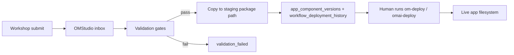
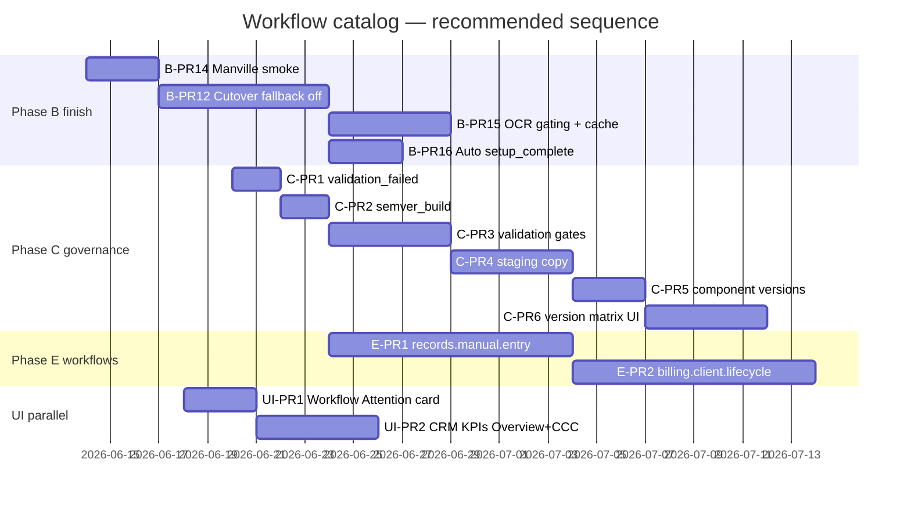

# Workflow Catalog — Implementation Plan (Post-Decisions 2026-06-13)

**Source:** [workflow-catalog-open-questions.md](./workflow-catalog-open-questions.md) — product/operator decisions recorded 2026-06-13  
**Canonical E2E parish:** Manville **#46**  
**PR strategy:** Tracking PRs for Step 2/3 governance; direct deploy for small OM/OMAI slices where appropriate

---

## 1. Resolved decisions summary

| Area | Key decisions |
|------|----------------|
| **Validation** | Manville #46; adopt §K smoke checklist |
| **Workflow filing** | #7 `records.manual.entry` → #8 billing → #9 CRM → #10 decommission |
| **Catalog ops** | Auto `sync-production-states` after deploy + manual button |
| **Executive UI** | Workflow Operations section + compact Workflow Attention card |
| **Legacy retirement** | Phased only — after execution cutover (B-PR12) |
| **Promotion (Step 2)** | Hybrid staging copy · human deploy · 5 validation gates · `validation_failed` · mandatory semver_build |
| **Governance (Step 3)** | OMStudio sole UI by Q3 2026 · OMAI proxy/read-only · docs authority in OMStudio |
| **Identity** | Parish create (church-scoped) · limited roles · `church_users` wins · phased `users.church_id` deprecation |
| **Certificates** | Nudge only · warn on rector/seal · jurisdiction template warning goal |
| **OCR** | Goals for feature-flag or upload-attempt only · TTL + event cache · super_admin + cron refresh |
| **Enrollment/CRM** | Funnel KPIs on Overview + CCC · no CRM-only enrollment goals · no re-enrollment on same workflow |
| **Ops setup** | Auto-complete when checklist passes · platform override |
| **Feature flags** | DB overrides env; gate OCR/certs/billing/CRM/decommission only |
| **Migrations** | Ops owns all envs until automated |

---

## 2. Remaining unresolved items

| ID | Item | Impact | Suggested default if no answer by cutover |
|----|------|--------|-------------------------------------------|
| **A1** | Confirm review-decisions SQL on dev/staging | Env parity | Ops runs same migration set as prod |
| **A3** | Post-deploy runtime-cache refresh trigger | First KPI accuracy after deploy | One-shot refresh in `om-deploy.sh` after BE sync |
| **A5** | Step 1 sign-off signatory (`s1-r8`) | Roadmap checkbox | Platform lead signs §K checklist for church #46 |
| **D3** | Legacy table drop list + soak end date | Schema cleanup | 90 days after B-PR12 + list in Phase F doc |

Nothing else blocks Phase B cutover or Phase C kickoff.

---

## 3. Phase B — updated implementation implications

Phase B code is **shipped** (B-PR1–13). Decisions change **cutover behavior and follow-on work**, not core schema.

### 3.1 B-PR12 cutover (immediate)

| Action | Decision driver |
|--------|-----------------|
| Run §K smoke checklist on **church #46** | A4, J2, J3 |
| Compare execution vs resolver goals during soak | B5, H2 — phased deprecation requires parity evidence |
| Set `EXECUTION_FALLBACK_INFERENCE=false` after soak | B5 — only then begin retiring legacy paths |
| Auto-complete `church.ops.setup` execution when checklist passes | H3 — reconciler already infers steps; add auto `setup_complete` + execution terminal state |
| Do **not** show enrollment goals for CRM-only parishes | H5 — filter in `getGoalsForChurch` / resolver |
| OCR setup goals: feature-flag or upload-attempt only | G1 — update `resolveOcrSetupGoal` |
| Gate workflows per I3 | Extend `isWorkflowFeatureEnabled` for billing, CRM, decommission when filed |

### 3.2 Phase B follow-on PRs (post-cutover)

| PR | Work | Decisions |
|----|------|-----------|
| ~~**B-PR14**~~ | ~~Manville #46 smoke automation script + checklist doc~~ | **Shipped** — `server/scripts/workflow-smoke-manville.js` |
| **B-PR15** | OCR goal gating (G1) + cache event hook (G2) + cron refresh (G3) | G1–G3 |
| **B-PR16** | Auto `setup_complete` when ops checklist passes (H3) | H3 |
| **B-PR17** | CRM-only enrollment goal suppression (H5) | H5 |
| **B-PR18** | DB feature flag overrides (I4) + expand gated workflows (I3) | I3, I4 |
| **B-PR19** | Phased legacy retirement: deprecate `getEnrollmentLegacyProgress` (H2) | B5, H2 — **after** B-PR12 |
| **B-PR20** | Unlock audit event (E6) + `church_users` alignment in church-onboarding | E6, E4 |

### 3.3 Phase B env target (post B-PR12)

```
EXECUTION_MODEL_ENABLED=true
EXECUTION_WRITE_THROUGH=true
EXECUTION_READ_PRIMARY=true
EXECUTION_FALLBACK_INFERENCE=false   ← cutover
EXECUTION_ANALYTICS_ENABLED=true
```

---

## 4. Phase C — updated governance implications

Decisions **C1–C7, D1, D4, D5, J1** define Phase C scope.

### 4.1 Promotion flow (target state)



| Requirement | Implementation |
|-------------|----------------|
| **C1 Hybrid copy** | Approve handler copies artifact bundle to e.g. `/var/om-packages/staging/{target_app}/{full_version}/` — never writes into `/var/www/.../prod` directly |
| **C2 Human deploy** | Approve sets status `approved` / `deployed_pending`; operator runs deploy scripts manually |
| **C3 Gates** | Pre-approve: build pass · component drift clear · content hash match · preview URL reachable · target workflow production readiness 100% |
| **C4 Version matrix** | OMStudio refs tab: per-target deployed version grid; catalog drawer read-only mirror |
| **C5 Rollback** | Insert/update `app_component_versions`; set `rollback_of_version_id`; link `workflow_deployment_history.rollback_of_deployment_id` |
| **C6 semver_build** | Reject Workshop submit without valid `full_version` pattern `^\d+\.\d+\.\d+_\d+$` |
| **C7 validation_failed** | Migration: add enum value; UI shows retry path; stays out of approve queue until resubmitted |

### 4.2 Authority & UI

| Requirement | Implementation |
|-------------|----------------|
| **D4 OMStudio sole UI** | Remove approve/reject from OMAI CP (read-only proxy); timeline Q3 2026 for native OMStudio app |
| **D1 Q3 2026** | Milestone: OMStudio calls `/api/platform/workflow-refs` natively |
| **D5 Docs authority** | Export pipeline: OMStudio manifest → generated copies in `orthodoxmetrics/prod/docs/export/` |
| **J1 Tracking PR** | Single epic PR branch `feature/workflow-governance-phase-c` with sub-PRs merged in order |

### 4.3 Phase C PR sequence

| PR | Deliverable | Repo |
|----|-------------|------|
| **C-PR1** | `validation_failed` status + migration | OM |
| **C-PR2** | Mandatory semver_build validation on Workshop submit | OM |
| **C-PR3** | Validation gate service (build, drift, hash, preview, readiness) | OM |
| **C-PR4** | Staging package copy on approve (C1) | OM |
| **C-PR5** | `app_component_versions` write + rollback link to `workflow_deployment_history` (C5) | OM |
| **C-PR6** | Version matrix UI — OMStudio refs tab (C4) | OMAI |
| **C-PR7** | Catalog detail drawer read-only version mirror (C4) | OMAI |
| **C-PR8** | OMAI approve/reject → read-only; link to OMStudio (D4 transition) | OMAI |
| **C-PR9** | Auto `sync-production-states` post catalog deploy (A2, B3) | OM deploy hook |

---

## 5. Phase E — workflow #7–#10 (after B-PR12)

Priority locked by **B2**.

| # | Workflow key | Phase | Depends on |
|---|--------------|-------|------------|
| 7 | `records.manual.entry` | E-PR1 | B-PR12, execution reconciler pattern |
| 8 | `billing.client.lifecycle` | E-PR2 | #7 filed; `client_status` / billing fields |
| 9 | `crm.lead.nurture` | E-PR3 | H5 CRM goal pattern; ~80 pre-onboarded parishes |
| 10 | `church.decommission` | E-PR4 | `church-decom.js` routes |

Each filing PR includes: catalog seed SQL · step components · reconciler · write-through hooks · readiness/drift pass · Manville #46 smoke row where applicable.

**F4:** Certificate draft persistence is **explicitly deferred** until after #7 ships.

---

## 6. Cross-cutting UI / ops (parallel track)

| Item | PR | Repo | Decision |
|------|-----|------|----------|
| Workflow Attention stat card | UI-PR1 | OMAI | B4 |
| CRM funnel KPIs on Overview | UI-PR2 | OMAI | H1 |
| CRM funnel KPIs on CCC | UI-PR3 | OMAI | H1 |
| Certificate jurisdiction warning goal | OM-PR1 | OM | F3 |
| Rector/seal warn-only in cert flow | OM-PR2 | OM | F2 |
| Parish user create (church-scoped) | OM-PR3 | OM | E1, E2 |
| Phased `users.church_id` migration | OM-PR4 | OM | E5 |

---

## 7. Recommended overall PR sequence (next 90 days)



### Ordered merge list (strict)

1. **B-PR14** — Manville #46 smoke script + checklist run  
2. **UI-PR1** — Workflow Attention executive stat card (B4)  
3. **C-PR9** — Auto sync-production-states on catalog deploy (A2, B3)  
4. **B-PR12** — Cutover: `EXECUTION_FALLBACK_INFERENCE=false` after soak sign-off  
5. **B-PR15** — OCR goal gating + cache event hook + scheduled refresh (G1–G3)  
6. **B-PR16** — Auto `setup_complete` when ops checklist passes (H3)  
7. **B-PR17** — CRM-only enrollment goal suppression (H5)  
8. **C-PR1 → C-PR6** — Governance loop (tracking PR epic)  
9. **E-PR1** — File `records.manual.entry` (#7)  
10. **E-PR2 → E-PR4** — Workflows #8–#10  
11. **B-PR18 → B-PR20** — Feature flags DB, legacy deprecation, identity migration  
12. **UI-PR2 / UI-PR3** — CRM funnel KPIs (H1)  

---

## 8. Acceptance criteria by milestone

| Milestone | Done when |
|-----------|-----------|
| **B-PR12 complete** | Church #46 §K checklist green; `EXECUTION_FALLBACK_INFERENCE=false`; no resolver calls in prod logs |
| **Phase C MVP** | Workshop submit → gates → staging copy → history row → human deploy documented; `validation_failed` retry works |
| **Workflow #7 live** | `records.manual.entry` in catalog at production readiness 100%; reconciler + execution rows; Manville smoke extended |
| **Step 2 roadmap** | Roadmap s2-r1–r3 checked via real approve cycle with all five gates |
| **Q3 2026 OMStudio** | Native workflow-refs consumer; OMAI approve removed |

---

*Generated from product decisions 2026-06-13. Update when A1, A3, A5, or D3 are resolved.*
