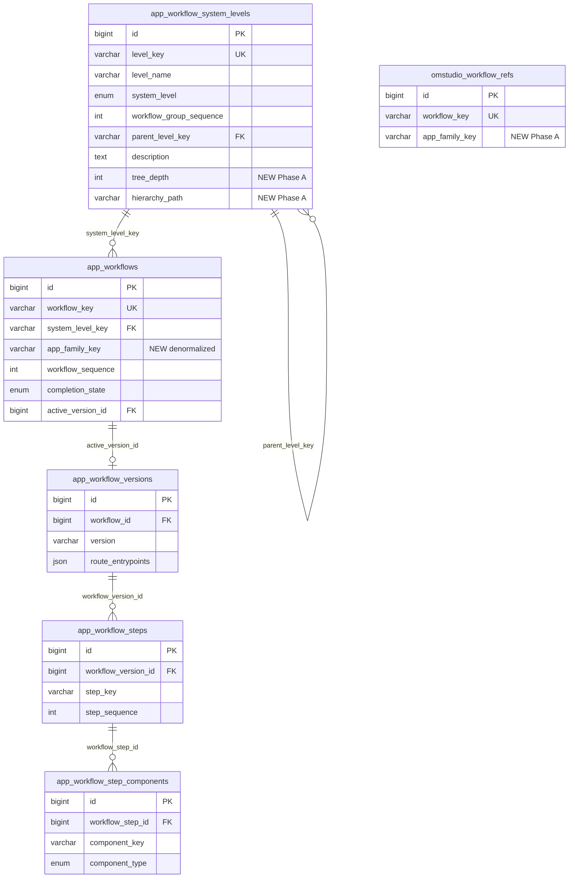
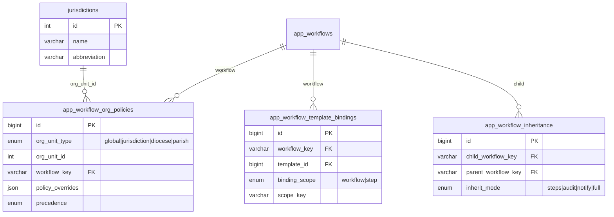
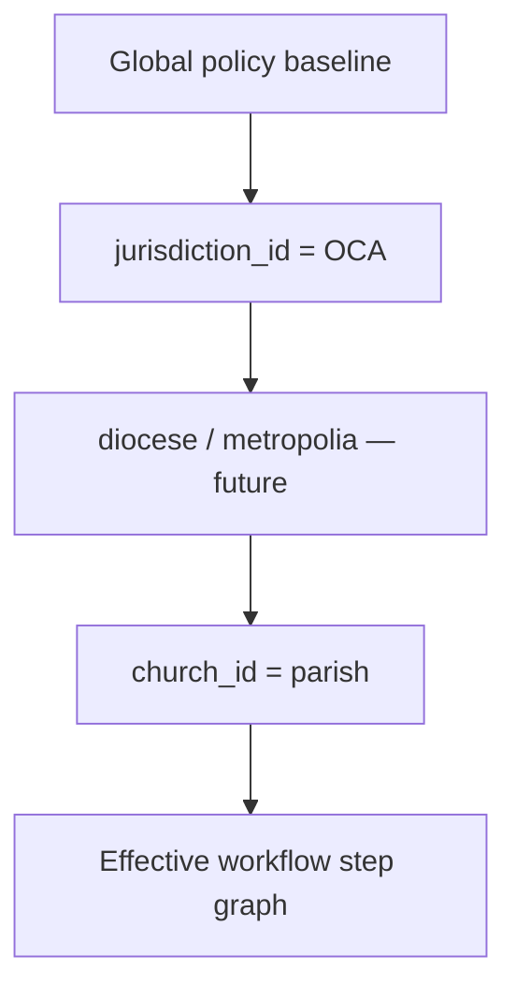

# Workflow Catalog — Phase A Implementation Design

**Workflow System Hierarchy & APP_FAMILY Model**

| Field | Value |
|-------|-------|
| **Status** | **Implemented** 2026-06-13 — migration `20260613_workflow_hierarchy_phase_a.sql` |
| **Date** | 2026-06-12 |
| **Prerequisite** | [Architecture gap analysis](./workflow-catalog-architecture-gap-analysis.md) directionally approved |
| **Inputs** | [Pipeline](./app-workflow-catalog-pipeline.md) · [Open questions](./workflow-catalog-open-questions.md) · [Gap analysis](./workflow-catalog-architecture-gap-analysis.md) |
| **Phase scope** | **A only** — hierarchy seed, schema extensions, API/UI additive changes, migration |

---

## 1. Purpose & success criteria

Phase A establishes the **canonical workflow taxonomy tree** without breaking existing workflow keys, resolvers, or catalog HTTP contracts.

**Success criteria:**

1. `app_workflow_system_levels` contains a complete **GLOBAL → APP_FAMILY → WORKFLOW_GROUP** tree with `parent_level_key` links.
2. All six APP_FAMILY nodes exist and every existing WORKFLOW_GROUP has a parent APP_FAMILY.
3. All six filed workflows retain `system_level_key` (WORKFLOW_GROUP) — **unchanged**.
4. Catalog APIs return **additive** hierarchy fields; existing clients continue to work.
5. OMAI Workflow Catalog UI can render **two-level grouping** (family → group → workflows).
6. OMStudio metadata contract includes hierarchy for governance scoping.
7. Future tables for inheritance, templates, and org-unit policy are **designed and stubbed** (not required for Phase A runtime).

**Out of scope for Phase A:**

- `church_workflow_executions` (Phase B)
- Workshop approve → `app_component_versions` loop (Phase C)
- Filing workflows #7–#15
- Materializing WORKFLOW / WORKFLOW_STEP / COMPONENT as rows in `app_workflow_system_levels`

---

## 2. Hierarchy model

### 2.1 Six `system_level` tiers

The enum already exists on `app_workflow_system_levels.system_level`. Phase A **activates** the top three tiers as rows; lower tiers remain **composed from existing tables** until Phase A.2+.

| Tier | `system_level` | Stored in Phase A | Example `level_key` |
|------|----------------|-------------------|---------------------|
| 1 | `GLOBAL` | `app_workflow_system_levels` row | `om_platform` |
| 2 | `APP_FAMILY` | `app_workflow_system_levels` row | `parish_lifecycle` |
| 3 | `WORKFLOW_GROUP` | `app_workflow_system_levels` row (existing) | `enrollment`, `ocr` |
| 4 | `WORKFLOW` | `app_workflows` (not duplicated in levels table) | `church.enrollment` |
| 5 | `WORKFLOW_STEP` | `app_workflow_steps` | `payment_pending` |
| 6 | `COMPONENT` | `app_workflow_step_components` | `onboarding.payment.pending` |

**Design rule:** `app_workflow_system_levels` is the **taxonomy registry**. `app_workflows` / steps / components are the **definition registry**. APIs **compose** a unified tree at read time.

### 2.2 Parent/child inheritance via `parent_level_key`

```mermaid
flowchart TB
  GLOBAL["GLOBAL · om_platform"]

  GLOBAL --> AF1["APP_FAMILY · parish_lifecycle"]
  GLOBAL --> AF2["APP_FAMILY · digitization"]
  GLOBAL --> AF3["APP_FAMILY · records_sacraments"]
  GLOBAL --> AF4["APP_FAMILY · identity_access"]
  GLOBAL --> AF5["APP_FAMILY · commercial_crm"]
  GLOBAL --> AF6["APP_FAMILY · platform_governance"]

  AF1 --> G_ENR["WORKFLOW_GROUP · enrollment"]
  AF1 --> G_OPS["WORKFLOW_GROUP · church_ops"]
  AF1 --> G_DEC["WORKFLOW_GROUP · decommission — planned"]

  AF2 --> G_OCR["WORKFLOW_GROUP · ocr"]
  AF2 --> G_OCRIMP["WORKFLOW_GROUP · ocr_import — planned"]

  AF3 --> G_REC["WORKFLOW_GROUP · records"]
  AF3 --> G_CERT["WORKFLOW_GROUP · certificates — planned alias"]

  AF4 --> G_ID["WORKFLOW_GROUP · identity"]
  AF4 --> G_EMAIL["WORKFLOW_GROUP · email_intake — planned"]

  AF5 --> G_CRM["WORKFLOW_GROUP · crm — planned"]
  AF5 --> G_BILL["WORKFLOW_GROUP · billing — planned"]

  AF6 --> G_GOV["WORKFLOW_GROUP · governance — planned"]

  G_ENR --> W1["WORKFLOW · church.enrollment"]
  G_OPS --> W2["WORKFLOW · church.ops.setup"]
  G_OCR --> W3["WORKFLOW · ocr.setup.wizard"]
  G_OCR --> W4["WORKFLOW · ocr.batch.review"]
  G_REC --> W5["WORKFLOW · records.certificate.generate"]
  G_ID --> W6["WORKFLOW · identity.user.admin"]
```



### 2.3 Inheritance semantics (Phase A)

| Inheritance type | Phase A | Future phase |
|------------------|---------|--------------|
| **Taxonomic parent** | `parent_level_key` on system level rows | Unchanged |
| **Workflow extends workflow** | Not implemented | `app_workflow_inheritance` (§9) |
| **Step reuse from template** | Not implemented | `app_workflow_template_bindings` (§9) |
| **Jurisdiction policy override** | Not implemented | `app_workflow_org_policies` (§10) |

**Phase A inheritance = tree navigation only.** Child groups inherit **display grouping and governance scope**, not step definitions.

### 2.4 Initial APP_FAMILY definitions

| `level_key` | `level_name` | `workflow_group_sequence` | Description | Child WORKFLOW_GROUPs (Phase A) |
|-------------|--------------|---------------------------|-------------|--------------------------------|
| `parish_lifecycle` | Parish Lifecycle | 100 | Enrollment through ops setup and decommission | `enrollment`, `church_ops` |
| `digitization` | Digitization | 200 | OCR setup, batch review, bulk import | `ocr` |
| `records_sacraments` | Records & Sacraments | 300 | Manual entry, certificates, data audit | `records` |
| `identity_access` | Identity & Access | 400 | Users, roles, email intake | `identity` |
| `commercial_crm` | Commercial & CRM | 500 | Leads, billing, contact nurture | *(none filed yet — reserve groups in §2.5)* |
| `platform_governance` | Platform Governance | 600 | Workshop promotion, rollback, catalog ops | *(none filed yet — reserve in §2.5)* |

**GLOBAL root:**

| `level_key` | `level_name` | `workflow_group_sequence` | `parent_level_key` |
|-------------|--------------|---------------------------|--------------------|
| `om_platform` | OrthodoxMetrics Platform | 0 | `NULL` |

### 2.5 WORKFLOW_GROUP → APP_FAMILY mapping (migration)

| Existing `level_key` | Current seq | New parent | New seq (display) |
|----------------------|-------------|------------|-------------------|
| `enrollment` | 10 | `parish_lifecycle` | 110 |
| `church_ops` | 15 | `parish_lifecycle` | 115 |
| `ocr` | 20 | `digitization` | 210 |
| `records` | 30 | `records_sacraments` | 310 |
| `identity` | 40 | `identity_access` | 410 |

**Planned groups (Phase A seed, zero workflows):**

| `level_key` | Parent | Seq | Purpose |
|-------------|--------|-----|---------|
| `decommission` | `parish_lifecycle` | 120 | Workflow #10 |
| `ocr_import` | `digitization` | 220 | Workflow #13 |
| `certificates` | `records_sacraments` | 320 | Optional split from `records` |
| `email_intake` | `identity_access` | 420 | Workflow #11 |
| `crm` | `commercial_crm` | 510 | Workflow #9 |
| `billing` | `commercial_crm` | 520 | Workflow #8 |
| `governance` | `platform_governance` | 610 | Workflow #15 |

---

## 3. ERD

### 3.1 Phase A (implemented tables + new columns)



### 3.2 Future phases (design only — not Phase A migration)



---

## 4. Database schema changes (Phase A)

### 4.1 `app_workflow_system_levels` — additive columns

| Column | Type | Purpose |
|--------|------|---------|
| `tree_depth` | `TINYINT UNSIGNED NOT NULL DEFAULT 0` | 0=GLOBAL, 1=APP_FAMILY, 2=WORKFLOW_GROUP |
| `hierarchy_path` | `VARCHAR(256) NULL` | Materialized path: `/om_platform/parish_lifecycle/enrollment` |
| `is_active` | `TINYINT(1) NOT NULL DEFAULT 1` | Soft-disable without delete |

**Index:** `KEY idx_awsl_parent (parent_level_key)`, `KEY idx_awsl_system_level (system_level, workflow_group_sequence)`

**Optional FK (Phase A):** `CONSTRAINT fk_awsl_parent FOREIGN KEY (parent_level_key) REFERENCES app_workflow_system_levels(level_key) ON UPDATE CASCADE`

> Use `ON UPDATE CASCADE` because `level_key` is the natural key. Defer `ON DELETE RESTRICT` to prevent orphaning.

### 4.2 `app_workflows` — denormalized family key

| Column | Type | Purpose |
|--------|------|---------|
| `app_family_key` | `VARCHAR(64) NULL` | Fast filter; backfilled from group parent |

**Index:** `KEY idx_aw_app_family (app_family_key, workflow_sequence)`

**Rule:** `app_family_key` is **derived** from `system_level_key → parent_level_key`. Application writes must keep in sync (trigger or service layer in Phase A implementation).

### 4.3 `omstudio_workflow_refs` — governance scope

| Column | Type | Purpose |
|--------|------|---------|
| `app_family_key` | `VARCHAR(64) NULL` | OMStudio filters refs by family |

### 4.4 No changes to

- `app_workflow_steps`, `app_workflow_step_components` (tier 5–6 unchanged)
- `workflowGoalsService` resolver registry (Phase A)
- `system_level_key` values on existing workflows

---

## 5. API impacts

### 5.1 Backward compatibility contract

| Endpoint | Breaking change? | Phase A behavior |
|----------|------------------|------------------|
| `GET /api/platform/workflow-catalog` | **No** | Add `workflow_hierarchy`, `app_family_key` per workflow |
| `GET /api/platform/workflow-catalog/:key` | **No** | Add `app_family_key`, `hierarchy_path`, `workflow_group_name` |
| `GET /api/platform/__omstudio/workflows/metadata` | **No** | Add `workflow_families[]` nested structure |
| `GET /api/workflow-goals` | **No** | Unchanged |
| `GET /api/platform/workflow-runtime-summary` | **No** | Optional `by_app_family` rollup (additive) |
| `GET /api/platform/governance/workflow-authority` | **No** | Add `workflow_families` to manifest |
| `GET /api/platform/workflow-refs` | **No** | Add `app_family_key` on refs |

### 5.2 New response shapes (additive)

**`workflow_hierarchy` on catalog list:**

```json
{
  "workflow_hierarchy": {
    "global": { "level_key": "om_platform", "level_name": "OrthodoxMetrics Platform" },
    "families": [
      {
        "level_key": "parish_lifecycle",
        "level_name": "Parish Lifecycle",
        "groups": [
          {
            "level_key": "enrollment",
            "workflows": [{ "workflow_key": "church.enrollment", "..." }]
          }
        ]
      }
    ]
  },
  "workflow_system_levels": [ "... existing flat array preserved ..." ],
  "workflows": [ "... existing flat array preserved ..." ]
}
```

**Per-workflow additive fields:**

```json
{
  "workflow_key": "church.enrollment",
  "system_level_key": "enrollment",
  "app_family_key": "parish_lifecycle",
  "hierarchy_path": "/om_platform/parish_lifecycle/enrollment/church.enrollment"
}
```

### 5.3 New optional query parameters (Phase A implementation)

| Endpoint | Param | Purpose |
|----------|-------|---------|
| `GET /workflow-catalog` | `?app_family=parish_lifecycle` | Filter workflows |
| `GET /workflow-catalog` | `?format=hierarchy` | Return hierarchy-first (default remains flat+hierarchy) |

### 5.4 Service layer changes (implementation phase — not in this PR)

| File | Change |
|------|--------|
| `workflowCatalogService.js` | `fetchWorkflowHierarchy()`, `resolveAppFamilyKey()` |
| `platform-workflows.js` | Compose `workflow_hierarchy` in list handler |
| `platform.js` | `buildWorkflowMetadata()` includes families |
| `workflowGovernanceService.js` | Authority manifest lists families |

---

## 6. OMAI Workflow Catalog UI changes

### 6.1 Catalog view (`Workflows.tsx`)

| Change | Detail |
|--------|--------|
| **Three-tier accordion** | APP_FAMILY → WORKFLOW_GROUP → workflow cards |
| **Fallback** | If `workflow_hierarchy` absent, use current flat `grouped` memo (backward compat) |
| **Family badges** | Color per family (reuse onboarding phase colors where sensible) |
| **Stats row** | Add per-family workflow count + production-ready count |
| **Roadmap** | Group Step 1 readiness items under family headings |

### 6.2 OMStudio refs tab

- Group synced refs by `app_family_key`
- Authority panel shows six families + doc links per family (future)

### 6.3 No change required

- Workshop submit form (still uses `target_workflow_key`)
- Goal strip / CCC (unchanged in Phase A)

---

## 7. OMStudio governance implications

| Area | Phase A impact |
|------|----------------|
| **Authority manifest** | Lists 6 APP_FAMILY scopes as governance domains |
| **Deployment requests** | `target_workflow_key` unchanged; optional `target_app_family` derived at submit |
| **Workflow refs sync** | `syncWorkflowRefs()` copies `app_family_key` from `app_workflows` |
| **Approval scope** | Future: super_admin per-family approvers via `app_workflow_org_policies` |
| **Metadata contract** | `/__omstudio/workflows/metadata` becomes family-aware for OMStudio native UI |
| **Documentation** | Phase A doc bundle index grouped by APP_FAMILY |

**OMStudio does not become sole approver in Phase A** — hierarchy is metadata only. Phase D (gap analysis) transfers authority.

---

## 8. Future: workflow inheritance & templates (Phase A.2+)

### 8.1 Workflow inheritance

**Table:** `app_workflow_inheritance`

| Column | Purpose |
|--------|---------|
| `child_workflow_key` | Filed workflow |
| `parent_workflow_key` | Base workflow (e.g. shared audit tail) |
| `inherit_mode` | `steps_append` \| `audit_only` \| `notify_only` \| `full_merge` |
| `step_keys` | JSON allowlist of inherited steps |

**Resolver behavior (future):** Merge parent steps into `buildWorkflowContext()` when child version marks `inherits_from`.

**Example:** `records.manual.entry` inherits `audit_complete` step pattern from `records.certificate.generate`.

### 8.2 Workflow templates

**Bridge:** `app_workflow_template_bindings` links `app_workflows` to legacy `workflow_templates` for **AI/prompt pipelines only** — not parish business workflows.

**Rule:** Business workflows use `app_workflows*`. `workflow_templates` remains for OMAI prompt plans; bindings are optional cross-reference, not execution path.

### 8.3 Jurisdiction-level overrides

**Table:** `app_workflow_org_policies` (Phase C+)

| `org_unit_type` | Source table | Example override |
|-----------------|--------------|------------------|
| `global` | — | Default policy |
| `jurisdiction` | `jurisdictions` | Extra certificate template step for OCA |
| `diocese` | Future `dioceses` or `church_enrichment_profiles` | Stricter email intake approval |
| `parish` | `churches` | Waive billing step |

**Precedence (high → low):** `parish` → `diocese` → `jurisdiction` → `global`

**Phase A:** Seed `app_workflow_policies` with one global `catalog.hierarchy.v1` policy JSON documenting tree — no runtime enforcement.

---

## 9. Future: diocesan & jurisdiction org-unit policy inheritance (Phase D+)



**Use cases:**

- OCA parishes require extra `records.manual.entry` validation step
- Antiochian jurisdiction mandates `billing.client.lifecycle` before `church.ops.setup` finalize
- Diocese suspends `ocr.batch.review` seed without rector approval

**Integration with CRM:** `churches.jurisdiction_id` + `omai_crm_leads` drive policy lookup in `getGoalsForChurch()` (Phase D).

**Phase A:** Document only; add `jurisdiction_id` nullable column to `app_workflow_org_policies` in stub migration comment.

---

## 10. Migration plan

### 10.1 Pre-migration

| Step | Action |
|------|--------|
| 1 | Snapshot `app_workflow_system_levels` and `app_workflows` |
| 2 | Verify 6 filed workflows and 5 WORKFLOW_GROUP rows exist |
| 3 | Deploy Phase A SQL on staging `orthodoxmetrics_db` |
| 4 | Run API smoke: catalog list, detail, omstudio metadata, workflow-refs sync |

### 10.2 Migration execution order

1. Add columns (`tree_depth`, `hierarchy_path`, `is_active`, `app_family_key`)
2. Insert GLOBAL + APP_FAMILY rows
3. Insert planned WORKFLOW_GROUP placeholders
4. Update existing WORKFLOW_GROUP `parent_level_key`, sequences, paths
5. Backfill `app_workflows.app_family_key`
6. Backfill `omstudio_workflow_refs.app_family_key`
7. Seed global hierarchy policy JSON
8. Run `sync-production-states` + `syncWorkflowRefs`

### 10.3 Post-migration verification

```sql
-- Every group has parent
SELECT level_key FROM app_workflow_system_levels
WHERE system_level = 'WORKFLOW_GROUP' AND parent_level_key IS NULL;

-- Every workflow has family
SELECT workflow_key FROM app_workflows WHERE app_family_key IS NULL;

-- Hierarchy depth
SELECT level_key, system_level, tree_depth, hierarchy_path
FROM app_workflow_system_levels ORDER BY workflow_group_sequence;
```

### 10.4 Application deploy order

1. **DB migration** (SQL file below)
2. **OM backend** — `workflowCatalogService` hierarchy helpers
3. **OMAI backend** — platform-workflows list/metadata
4. **OMAI frontend** — Workflows.tsx three-tier UI
5. **Sync** — workflow refs + production states

---

## 11. Rollback plan

| Step | Action |
|------|--------|
| 1 | Revert OM/OMAI application commits (hierarchy-aware code) |
| 2 | Run rollback SQL (§12.2) |
| 3 | Verify APIs return pre-Phase-A shape |
| 4 | Re-run `syncWorkflowRefs` |

**Data preserved:** Workflow definitions, steps, components, resolvers — unaffected.

**Safe rollback window:** Before workflows #7+ are filed against new placeholder groups.

---

## 12. Risk assessment

| ID | Risk | L | I | Mitigation |
|----|------|---|---|------------|
| PA1 | UI breaks on flat `grouped` memo | M | M | Dual response: flat + hierarchy; UI fallback |
| PA2 | `parent_level_key` FK blocks group rename | L | M | `ON UPDATE CASCADE`; no deletes |
| PA3 | Denormalized `app_family_key` drifts | M | M | DB trigger on group parent change; reconciliation job |
| PA4 | OMStudio metadata consumers parse old shape | L | H | Additive fields only; version bump in metadata `schema_version` |
| PA5 | Sequence renumber confuses operators | M | L | Document mapping table; keep old seq in migration notes |
| PA6 | Placeholder groups appear empty in UI | L | L | Mark `is_active=0` or "planned" chip until workflow filed |
| PA7 | Commercial/governance families have no workflows | M | L | Show "0 filed — reserved" in UI |

---

## 13. Implementation phases (full program)

| Phase | Name | This doc? |
|-------|------|-----------|
| **A** | Hierarchy seed + API/UI additive | **Yes — this document** |
| A.2 | WORKFLOW rows in system_levels (optional materialization) | Future |
| B | `church_workflow_executions` | Gap analysis §8 |
| C | Workshop `_N` closed loop | Gap analysis §4.1 |
| D | OMStudio authority transfer | Gap analysis §4.2 |
| E | Workflows #7–#9 | Gap analysis §6 |
| F | Scale / cache events | Gap analysis §4.5 |
| G | Org-unit policies | §9–§10 |

### Phase A implementation tasks (when approved)

| # | Task | Owner |
|---|------|-------|
| A1 | Run SQL migration | Ops |
| A2 | `workflowCatalogService.fetchWorkflowHierarchy()` | OM |
| A3 | Catalog API additive fields | OM + OMAI proxy |
| A4 | OMStudio metadata families | OM `platform.js` |
| A5 | `syncWorkflowRefs` family key | OMAI |
| A6 | Workflows.tsx three-tier UI | OMAI |
| A7 | Update pipeline + open-questions docs | Docs |
| A8 | Smoke + operator sign-off | QA |

---

## 14. Exact SQL migration proposal

**Proposed file:** `server/database/migrations/20260613_workflow_hierarchy_phase_a.sql`  
**Database:** `orthodoxmetrics_db`  
**Idempotent:** Yes (`INSERT … ON DUPLICATE KEY UPDATE`, conditional `ADD COLUMN`)

```sql
-- ============================================================================
-- Workflow Catalog Phase A — Workflow System Hierarchy
-- 2026-06-13 | GLOBAL → APP_FAMILY → WORKFLOW_GROUP tree
-- Prerequisite: 20260608_app_workflow_catalog.sql, 20260612_* review decisions
-- Rollback: §14.2 in workflow-catalog-phase-a-hierarchy-design.md
-- ============================================================================

-- ─── 1. Extend app_workflow_system_levels ───────────────────────────────────

ALTER TABLE app_workflow_system_levels
  ADD COLUMN tree_depth TINYINT UNSIGNED NOT NULL DEFAULT 2 AFTER workflow_group_sequence;

ALTER TABLE app_workflow_system_levels
  ADD COLUMN hierarchy_path VARCHAR(256) NULL AFTER tree_depth;

ALTER TABLE app_workflow_system_levels
  ADD COLUMN is_active TINYINT(1) NOT NULL DEFAULT 1 AFTER hierarchy_path;

CREATE INDEX idx_awsl_parent ON app_workflow_system_levels (parent_level_key);
CREATE INDEX idx_awsl_level_seq ON app_workflow_system_levels (system_level, workflow_group_sequence);

-- ─── 2. GLOBAL root ─────────────────────────────────────────────────────────

INSERT INTO app_workflow_system_levels
  (level_key, level_name, system_level, workflow_group_sequence, tree_depth, parent_level_key, hierarchy_path, description)
VALUES
  ('om_platform', 'OrthodoxMetrics Platform', 'GLOBAL', 0, 0, NULL,
   '/om_platform', 'Root taxonomy node for all OM workflow systems')
ON DUPLICATE KEY UPDATE
  system_level = 'GLOBAL',
  tree_depth = 0,
  hierarchy_path = '/om_platform',
  level_name = VALUES(level_name);

-- ─── 3. APP_FAMILY nodes ────────────────────────────────────────────────────

INSERT INTO app_workflow_system_levels
  (level_key, level_name, system_level, workflow_group_sequence, tree_depth, parent_level_key, hierarchy_path, description)
VALUES
  ('parish_lifecycle', 'Parish Lifecycle', 'APP_FAMILY', 100, 1, 'om_platform',
   '/om_platform/parish_lifecycle', 'Enrollment, ops setup, decommission'),
  ('digitization', 'Digitization', 'APP_FAMILY', 200, 1, 'om_platform',
   '/om_platform/digitization', 'OCR setup, batch review, bulk import'),
  ('records_sacraments', 'Records & Sacraments', 'APP_FAMILY', 300, 1, 'om_platform',
   '/om_platform/records_sacraments', 'Manual entry, certificates, audits'),
  ('identity_access', 'Identity & Access', 'APP_FAMILY', 400, 1, 'om_platform',
   '/om_platform/identity_access', 'Users, roles, email intake'),
  ('commercial_crm', 'Commercial & CRM', 'APP_FAMILY', 500, 1, 'om_platform',
   '/om_platform/commercial_crm', 'Leads, billing, contact nurture'),
  ('platform_governance', 'Platform Governance', 'APP_FAMILY', 600, 1, 'om_platform',
   '/om_platform/platform_governance', 'Workshop promotion, rollback, catalog ops')
ON DUPLICATE KEY UPDATE
  system_level = 'APP_FAMILY',
  tree_depth = 1,
  parent_level_key = VALUES(parent_level_key),
  hierarchy_path = VALUES(hierarchy_path),
  workflow_group_sequence = VALUES(workflow_group_sequence),
  level_name = VALUES(level_name);

-- ─── 4. Reparent existing WORKFLOW_GROUP rows ───────────────────────────────

UPDATE app_workflow_system_levels SET
  parent_level_key = 'parish_lifecycle',
  tree_depth = 2,
  workflow_group_sequence = 110,
  hierarchy_path = '/om_platform/parish_lifecycle/enrollment'
WHERE level_key = 'enrollment' AND system_level = 'WORKFLOW_GROUP';

UPDATE app_workflow_system_levels SET
  parent_level_key = 'parish_lifecycle',
  tree_depth = 2,
  workflow_group_sequence = 115,
  hierarchy_path = '/om_platform/parish_lifecycle/church_ops'
WHERE level_key = 'church_ops' AND system_level = 'WORKFLOW_GROUP';

UPDATE app_workflow_system_levels SET
  parent_level_key = 'digitization',
  tree_depth = 2,
  workflow_group_sequence = 210,
  hierarchy_path = '/om_platform/digitization/ocr'
WHERE level_key = 'ocr' AND system_level = 'WORKFLOW_GROUP';

UPDATE app_workflow_system_levels SET
  parent_level_key = 'records_sacraments',
  tree_depth = 2,
  workflow_group_sequence = 310,
  hierarchy_path = '/om_platform/records_sacraments/records'
WHERE level_key = 'records' AND system_level = 'WORKFLOW_GROUP';

UPDATE app_workflow_system_levels SET
  parent_level_key = 'identity_access',
  tree_depth = 2,
  workflow_group_sequence = 410,
  hierarchy_path = '/om_platform/identity_access/identity'
WHERE level_key = 'identity' AND system_level = 'WORKFLOW_GROUP';

-- ─── 5. Planned WORKFLOW_GROUP placeholders (no workflows yet) ────────────────

INSERT INTO app_workflow_system_levels
  (level_key, level_name, system_level, workflow_group_sequence, tree_depth, parent_level_key, hierarchy_path, description, is_active)
VALUES
  ('decommission', 'Decommission', 'WORKFLOW_GROUP', 120, 2, 'parish_lifecycle',
   '/om_platform/parish_lifecycle/decommission', 'Parish export, disable, cleanup', 1),
  ('ocr_import', 'OCR Bulk Import', 'WORKFLOW_GROUP', 220, 2, 'digitization',
   '/om_platform/digitization/ocr_import', 'Historical bulk digitization', 1),
  ('certificates', 'Certificates', 'WORKFLOW_GROUP', 320, 2, 'records_sacraments',
   '/om_platform/records_sacraments/certificates', 'Certificate templates and generation', 1),
  ('email_intake', 'Email Intake', 'WORKFLOW_GROUP', 420, 2, 'identity_access',
   '/om_platform/identity_access/email_intake', 'Email submission review and auth', 1),
  ('crm', 'CRM & Leads', 'WORKFLOW_GROUP', 510, 2, 'commercial_crm',
   '/om_platform/commercial_crm/crm', 'Lead nurture through enrollment', 1),
  ('billing', 'Billing & Subscriptions', 'WORKFLOW_GROUP', 520, 2, 'commercial_crm',
   '/om_platform/commercial_crm/billing', 'Client billing lifecycle', 1),
  ('governance', 'Governance & Promotion', 'WORKFLOW_GROUP', 610, 2, 'platform_governance',
   '/om_platform/platform_governance/governance', 'Component promotion and rollback', 1)
ON DUPLICATE KEY UPDATE
  parent_level_key = VALUES(parent_level_key),
  tree_depth = 2,
  hierarchy_path = VALUES(hierarchy_path),
  workflow_group_sequence = VALUES(workflow_group_sequence),
  level_name = VALUES(level_name);

-- ─── 6. Denormalize app_family_key on app_workflows ──────────────────────────

ALTER TABLE app_workflows
  ADD COLUMN app_family_key VARCHAR(64) NULL AFTER system_level_key;

CREATE INDEX idx_aw_app_family ON app_workflows (app_family_key, workflow_sequence);

UPDATE app_workflows w
JOIN app_workflow_system_levels g ON g.level_key = w.system_level_key
JOIN app_workflow_system_levels f ON f.level_key = g.parent_level_key AND f.system_level = 'APP_FAMILY'
SET w.app_family_key = f.level_key;

-- Explicit overrides where group parent is correct
UPDATE app_workflows SET app_family_key = 'parish_lifecycle'
WHERE workflow_key IN ('church.enrollment', 'church.ops.setup');

UPDATE app_workflows SET app_family_key = 'digitization'
WHERE workflow_key IN ('ocr.setup.wizard', 'ocr.batch.review');

UPDATE app_workflows SET app_family_key = 'records_sacraments'
WHERE workflow_key = 'records.certificate.generate';

UPDATE app_workflows SET app_family_key = 'identity_access'
WHERE workflow_key = 'identity.user.admin';

-- ─── 7. OMStudio refs family scope ────────────────────────────────────────────

ALTER TABLE omstudio_workflow_refs
  ADD COLUMN app_family_key VARCHAR(64) NULL AFTER workflow_key;

UPDATE omstudio_workflow_refs r
JOIN app_workflows w ON w.workflow_key = r.workflow_key
SET r.app_family_key = w.app_family_key;

-- ─── 8. Global hierarchy policy seed (scaffolding — no runtime enforcement) ───

INSERT INTO app_workflow_policies (policy_key, policy_name, policy_rules, lifecycle_status)
VALUES (
  'catalog.hierarchy.v1',
  'Workflow Catalog Hierarchy v1',
  JSON_OBJECT(
    'schema_version', '1.0.0',
    'global_key', 'om_platform',
    'app_families', JSON_ARRAY(
      'parish_lifecycle', 'digitization', 'records_sacraments',
      'identity_access', 'commercial_crm', 'platform_governance'
    ),
    'inheritance_enabled', false,
    'org_policy_enabled', false
  ),
  'active'
)
ON DUPLICATE KEY UPDATE
  policy_rules = VALUES(policy_rules),
  lifecycle_status = 'active';

INSERT INTO app_workflow_policy_assignments (policy_id, workflow_key, assignment_scope, scope_key)
SELECT p.id, 'church.enrollment', 'workflow', NULL
FROM app_workflow_policies p WHERE p.policy_key = 'catalog.hierarchy.v1'
ON DUPLICATE KEY UPDATE policy_id = VALUES(policy_id);

-- ─── 9. Metadata schema version marker ───────────────────────────────────────

INSERT INTO workflow_runtime_cache (cache_key, payload)
VALUES ('catalog.hierarchy.v1', JSON_OBJECT(
  'schema_version', '1.0.0',
  'phase', 'A',
  'migrated_at', NOW(),
  'global_key', 'om_platform',
  'app_family_count', 6,
  'workflow_group_count', 12
))
ON DUPLICATE KEY UPDATE
  payload = VALUES(payload),
  refreshed_at = CURRENT_TIMESTAMP;
```

### 14.1 Rollback SQL

```sql
-- Phase A rollback — run only after reverting application code

UPDATE app_workflow_system_levels SET parent_level_key = NULL, tree_depth = 2, hierarchy_path = NULL
WHERE system_level IN ('WORKFLOW_GROUP', 'APP_FAMILY', 'GLOBAL');

DELETE FROM app_workflow_system_levels
WHERE level_key IN (
  'om_platform', 'parish_lifecycle', 'digitization', 'records_sacraments',
  'identity_access', 'commercial_crm', 'platform_governance',
  'decommission', 'ocr_import', 'certificates', 'email_intake',
  'crm', 'billing', 'governance'
);

-- Restore original sequences (pre-Phase-A)
UPDATE app_workflow_system_levels SET workflow_group_sequence = 10 WHERE level_key = 'enrollment';
UPDATE app_workflow_system_levels SET workflow_group_sequence = 15 WHERE level_key = 'church_ops';
UPDATE app_workflow_system_levels SET workflow_group_sequence = 20 WHERE level_key = 'ocr';
UPDATE app_workflow_system_levels SET workflow_group_sequence = 30 WHERE level_key = 'records';
UPDATE app_workflow_system_levels SET workflow_group_sequence = 40 WHERE level_key = 'identity';

ALTER TABLE app_workflows DROP COLUMN app_family_key;
ALTER TABLE omstudio_workflow_refs DROP COLUMN app_family_key;

ALTER TABLE app_workflow_system_levels
  DROP COLUMN tree_depth,
  DROP COLUMN hierarchy_path,
  DROP COLUMN is_active;

DELETE FROM workflow_runtime_cache WHERE cache_key = 'catalog.hierarchy.v1';

-- Optional: remove policy if no dependents
-- DELETE FROM app_workflow_policy_assignments WHERE policy_id IN (SELECT id FROM app_workflow_policies WHERE policy_key = 'catalog.hierarchy.v1');
-- DELETE FROM app_workflow_policies WHERE policy_key = 'catalog.hierarchy.v1';
```

---

## 15. Unified hierarchy diagram (post–Phase A)

```
GLOBAL: om_platform (OrthodoxMetrics Platform)
├── APP_FAMILY: parish_lifecycle
│   ├── WORKFLOW_GROUP: enrollment
│   │   └── WORKFLOW: church.enrollment
│   │       ├── STEP: submit_enrollment → COMPONENT: ...
│   │       ├── STEP: payment_pending → COMPONENT: ...
│   │       └── STEP: activate_parish → COMPONENT: ...
│   ├── WORKFLOW_GROUP: church_ops
│   │   └── WORKFLOW: church.ops.setup
│   └── WORKFLOW_GROUP: decommission [planned]
├── APP_FAMILY: digitization
│   ├── WORKFLOW_GROUP: ocr
│   │   ├── WORKFLOW: ocr.setup.wizard
│   │   └── WORKFLOW: ocr.batch.review
│   └── WORKFLOW_GROUP: ocr_import [planned]
├── APP_FAMILY: records_sacraments
│   ├── WORKFLOW_GROUP: records
│   │   └── WORKFLOW: records.certificate.generate
│   └── WORKFLOW_GROUP: certificates [planned]
├── APP_FAMILY: identity_access
│   ├── WORKFLOW_GROUP: identity
│   │   └── WORKFLOW: identity.user.admin
│   └── WORKFLOW_GROUP: email_intake [planned]
├── APP_FAMILY: commercial_crm
│   ├── WORKFLOW_GROUP: crm [planned]
│   └── WORKFLOW_GROUP: billing [planned]
└── APP_FAMILY: platform_governance
    └── WORKFLOW_GROUP: governance [planned]
```

---

## 16. Approval checklist

| # | Item | Approver | Approved |
|---|------|----------|----------|
| 1 | Six APP_FAMILY keys and names | Product | ☐ |
| 2 | WORKFLOW_GROUP reparenting map | Engineering | ☐ |
| 3 | Placeholder groups seeded inactive vs active | Product | ☐ |
| 4 | Additive API contract (no breaking changes) | Engineering | ☐ |
| 5 | `app_family_key` denormalization | Engineering | ☐ |
| 6 | OMAI three-tier UI | Product/Design | ☐ |
| 7 | SQL migration §14 on staging first | Ops | ☐ |
| 8 | Rollback SQL §14.1 tested on staging | Ops | ☐ |

---

## 17. Related documents

| Document | Relationship |
|----------|--------------|
| [app-workflow-catalog-pipeline.md](./app-workflow-catalog-pipeline.md) | Update §2 architecture after Phase A ships |
| [workflow-catalog-architecture-gap-analysis.md](./workflow-catalog-architecture-gap-analysis.md) | Phase A implements §4.3, §5 |
| [workflow-catalog-open-questions.md](./workflow-catalog-open-questions.md) | Phase B+ questions remain open |
| [workflow-catalog-review-implementation.md](./workflow-catalog-review-implementation.md) | Unchanged — pre-Phase A shipped work |

---

*Design package only. Implementation begins after §16 approval.*
