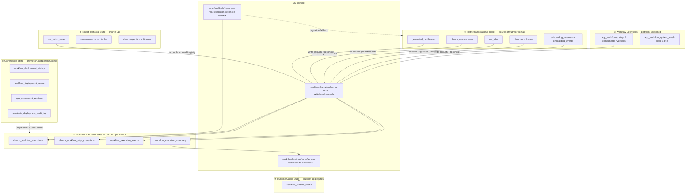
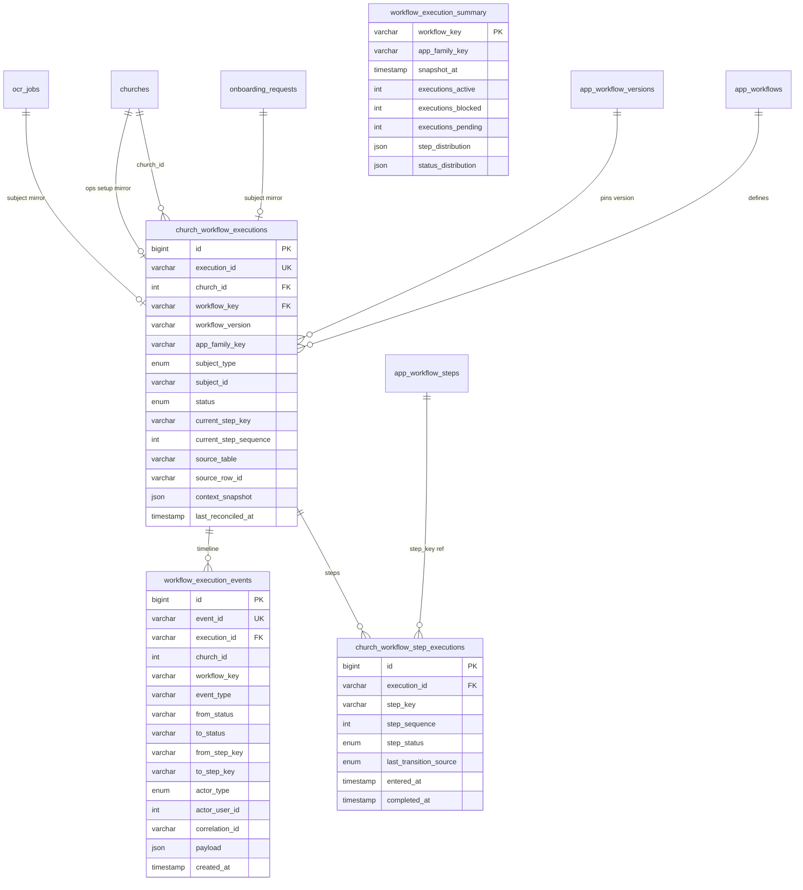
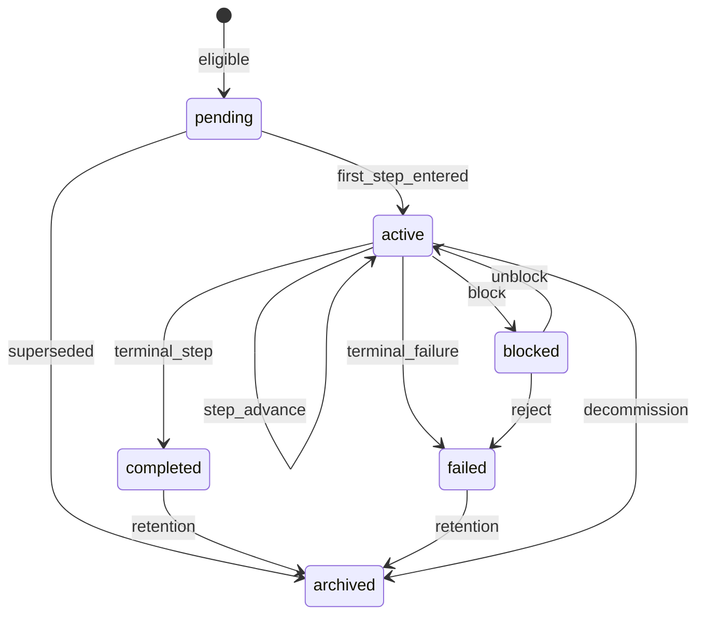
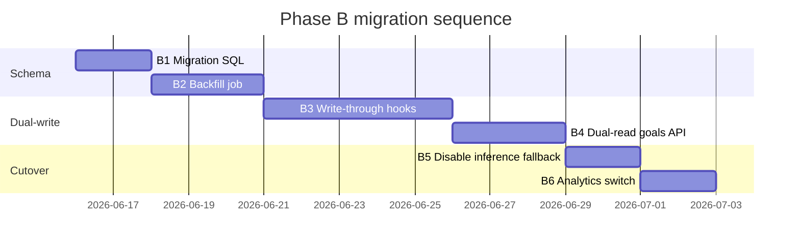

# Workflow Catalog — Phase B Implementation Design

**Workflow Execution Model — First-Class Platform Capability**

| Field | Value |
|-------|-------|
| **Status** | **B-PR1–B-PR4 implemented** — schema + service + reconcilers + backfill; write-through pending B-PR5+ |
| **Date** | 2026-06-13 |
| **Prerequisite** | [Phase A hierarchy](./workflow-catalog-phase-a-hierarchy-design.md) shipped (`20260613_workflow_hierarchy_phase_a.sql`) |
| **Inputs** | [Gap analysis](./workflow-catalog-architecture-gap-analysis.md) §4.4, §7, §8 · [Open questions](./workflow-catalog-open-questions.md) · `workflowGoalsService.js` resolvers |
| **Phase scope** | **B only** — execution schema, sync/reconcile design, APIs, migration; **no code** in this deliverable |

---

## 1. Purpose & success criteria

Phase B makes **per-church workflow execution** a durable, queryable platform capability. Today, `workflowGoalsService.js` **infers** current step from operational tables (`onboarding_requests`, `churches`, `ocr_jobs`, tenant `ocr_setup_state`, etc.). That pattern does not scale to cross-parish analytics (“churches stuck on step X”) and blocks filing workflows #7–#15 with consistent runtime semantics.

**Success criteria:**

1. `church_workflow_executions` is the **canonical per-church workflow state** for all filed workflows (6 today, 15 target).
2. Five state layers are **explicitly separated** with documented read/write ownership (§3).
3. Goals API and executive KPIs **read execution rows first**; resolver inference becomes reconcile input, not primary read path.
4. Lifecycle states (`pending` → `active` → `completed` / `failed` / `archived`, with `blocked`) are enforced in schema and APIs.
5. Every step transition produces an **append-only event** in `workflow_execution_events`.
6. Backfill + write-through + nightly reconcile migrate all six workflows without parish UI regression.
7. Cross-tenant queries at **1,000 churches** complete in &lt;500ms on indexed execution + summary tables (§12).

**Out of scope for Phase B:**

- Workshop approve → `app_component_versions` loop (Phase C)
- OMStudio authority transfer (Phase D)
- Filing workflows #7–#15 (Phase E — depends on B)
- Replacing `onboarding_events` or other domain audit tables (execution events **correlate**, not replace)

---

## 2. Architecture overview



### 2.1 Design principles

| Principle | Rule |
|-----------|------|
| **Single write authority** | `workflowExecutionService` is the only writer to execution tables (except migration backfill job). |
| **Domain tables stay authoritative** | `onboarding_requests.status` remains legal source for enrollment; execution **mirrors** it with provenance. |
| **No inference on hot path** | After cutover, `getGoalsForChurch` does not scan tenant DBs or run heuristics unless `execution_stale` flag set. |
| **Idempotent transitions** | Same source status → same execution state produces no duplicate events (dedupe key). |
| **Subject-scoped instances** | Multi-instance workflows (enrollment request, OCR job) get one execution row per subject, not one row per church. |
| **Governance isolation** | Deployment/promotion state never stored in `church_workflow_executions`. |

---

## 3. State layer separation

| Layer | Store | Mutable by | Read by | Examples |
|-------|-------|------------|---------|----------|
| **① Workflow Definitions** | Platform `app_workflows*` | Migrations, catalog admin, Phase C promotion | Catalog APIs, resolvers (step list), execution service (version pin) | Steps, `step_kind`, routes, `completion_state` (definition readiness) |
| **② Workflow Execution State** | Platform `church_workflow_executions*` | `workflowExecutionService` | Goals API, CCC, executive overview, OMAI analytics | `status=active`, `current_step_key=payment_pending` |
| **③ Tenant Technical State** | Church DB (+ platform ops tables) | Domain services (onboarding, OCR, certificates) | Reconciler, step-specific validators | `ocr_setup_state.percent_complete`, record row counts |
| **④ Runtime Cache State** | Platform `workflow_runtime_cache` + `workflow_execution_summary` | Cache refresh worker / event hooks | Executive dashboard, catalog `/runtime` | OCR setup counts by bucket |
| **⑤ Governance State** | Platform `workflow_deployment_*`, `app_component_versions` | OMStudio/OMAI governance APIs | Workshop promotion UI | `full_version`, deploy queue |

### 3.1 What moves off inference

| Workflow | Today (inference) | Phase B (execution) |
|----------|-------------------|---------------------|
| `church.enrollment` | `resolveEnrollmentCurrentStep(onboarding_requests.*)` | Execution row keyed by `subject_type=onboarding_request`, `subject_id=ONB_*` |
| `church.ops.setup` | Heuristics on `churches.*` + staff counts | Execution row keyed by `church`; `source_table=churches` |
| `ocr.setup.wizard` | Tenant `ocr_setup_state` → step from % | Execution row + `tenant_snapshot` JSON refreshed on reconcile |
| `ocr.batch.review` | Per `ocr_jobs.review_status` | One execution per `ocr_job` subject |
| `records.certificate.generate` | “No certs yet + has records” | Execution `active` until first cert; then `completed` |
| `identity.user.admin` | `church_users` lock counts | Execution `active` while onboarding staff; `completed` when ≥2 active users |

### 3.2 What stays in domain tables

- **Enrollment status machine** — `onboardingService` continues to own `onboarding_requests.status` transitions.
- **OCR job pipeline** — `ocr_jobs.status` / `review_status` remain worker source of truth.
- **Church lifecycle flags** — `churches.setup_complete`, `client_status`, `billing_status` remain billing/CRM truth; execution reflects them.

---

## 4. Entity-relationship model



---

## 5. Execution lifecycle

### 5.1 Execution-level states

| Status | Meaning | Entry | Exit |
|--------|---------|-------|------|
| `pending` | Workflow applicable but not started | Church becomes eligible (e.g. enrolled, feature enabled) | First step entered → `active` |
| `active` | In progress at a catalog step | Step transition | Terminal step done → `completed`; unrecoverable error → `failed`; operator hold → `blocked` |
| `blocked` | Waiting on external dependency or operator | Admin/system marks blocked | Unblocked → `active`; terminal → `completed`/`failed` |
| `completed` | Terminal success | Final step / domain terminal status | Archive job → `archived` |
| `failed` | Terminal failure | Domain rejection, provisioning failed, unrecoverable | Manual reopen → `active` (rare); archive → `archived` |
| `archived` | Historical, no longer in goals/KPIs | Retention policy, decommission, superseded instance | — (terminal) |



### 5.2 Step-level states (`church_workflow_step_executions`)

| `step_status` | Meaning |
|---------------|---------|
| `pending` | Not yet reached |
| `active` | Current step |
| `completed` | Passed |
| `skipped` | Optional step bypassed (catalog `is_required=0`) |
| `failed` | Step failed (e.g. payment failed) |
| `blocked` | Step blocked independently of execution-level block |

**Invariant:** At most one `active` step per execution. `current_step_key` on parent row denormalizes the active step for indexed queries.

### 5.3 Mapping domain terminals → execution status

| Domain signal | Execution status |
|---------------|------------------|
| `onboarding_requests.status IN ('active')` | `completed` (enrollment) |
| `onboarding_requests.status IN ('rejected','cancelled')` | `failed` or `archived` (configurable per workflow) |
| `churches.setup_complete = 1` | `completed` (ops setup) |
| `ocr_setup_state.is_complete = 1` | `completed` (OCR setup) |
| `ocr_jobs.review_status = 'seeded'` | `completed` (batch review instance) |
| `generated_certificates` count &gt; 0 for church | `completed` (certificate goal workflow) |
| `church_users` active count ≥ 2, pending = 0 | `completed` (identity admin) |

---

## 6. Step transition model

### 6.1 Transition sources

| Source | `transition_source` | Who triggers | Examples |
|--------|---------------------|--------------|----------|
| **Automatic** | `automatic` | System on domain write | Provisioning pipeline advances step when `provisioning_status=church_created` |
| **User-driven** | `user` | Parish staff UI action | Complete record table config → advance to `activate_parish` |
| **Admin-driven** | `admin` | Platform admin / CCC | Staff sets enrollment to `payment_pending` |
| **System reconciliation** | `reconciliation` | Reconcile worker | Nightly job detects `onboarding_requests` ahead of execution |
| **Pipeline** | `pipeline` | Async worker / job handler | OCR worker moves job `review_status` |

### 6.2 Transition rules by `step_kind` (from catalog)

| `step_kind` | Default transition mode | Write path |
|-------------|-------------------------|------------|
| `human` | User-driven | UI action → domain update → write-through execution |
| `approval` | Admin-driven | Admin API → domain update → write-through |
| `system` | Automatic | Domain service completes → write-through |
| `pipeline_trigger` | Pipeline | Worker updates domain → write-through |
| `audit` | Automatic on criteria | Reconciler marks complete when audit criteria met |
| `notify` | Automatic after prerequisite | System after prior step complete |

### 6.3 Transition algorithm (pseudocode)

```
function applyTransition(execution, { to_step_key, to_status, source, actor, correlation_id }):
  assert execution.status in (pending, active, blocked) OR reopen policy

  dedupe_key = hash(execution_id, to_step_key, to_status, source, domain_snapshot)
  if eventExists(dedupe_key): return execution

  from_step = execution.current_step_key
  from_status = execution.status

  complete prior active step row (if advancing step)
  upsert step rows: mark to_step as active
  update execution: current_step_key, current_step_sequence, status
  insert workflow_execution_events row
  refresh workflow_execution_summary (async)
  invalidate workflow_runtime_cache keys for workflow_key (async)

  return execution
```

### 6.4 State machine — enrollment (reference)

```mermaid
stateDiagram-v2
  direction LR
  submit_enrollment --> staff_review : admin_review
  staff_review --> payment_pending : approve
  staff_review --> failed : reject
  payment_pending --> payment_received : payment_confirmed
  payment_received --> provision_tenant : admin_confirm
  provision_tenant --> create_admin_account : pipeline_complete
  create_admin_account --> await_first_login : account_created
  await_first_login --> configure_record_tables : first_login
  configure_record_tables --> activate_parish : tables_done
  activate_parish --> audit_complete : parish_active
  audit_complete --> [*]
```



---

## 7. Execution synchronization design

### 7.1 Sync modes

| Mode | When | Latency | Use |
|------|------|---------|-----|
| **Write-through** | Domain mutation succeeds | Immediate | All user/admin actions (primary) |
| **Event hook** | After known domain events | &lt;1s | `onboarding_events` insert, OCR job status change |
| **On-read reconcile** | Goals API cache miss / `stale_after` exceeded | Request time | Tenant OCR setup, low-frequency workflows |
| **Nightly batch** | Cron 02:00 UTC | Hours | Full consistency audit, summary rebuild |
| **Manual** | Operator POST `/reconcile` | On demand | Support/debug |

### 7.2 Per-source sync matrix

| Source table | Workflow(s) | Subject key | Write-through hook location | Reconcile rule |
|--------------|-------------|-------------|----------------------------|----------------|
| `onboarding_requests` | `church.enrollment` | `onboarding_request_id` | `onboardingService` status transitions | Map `status` + flags → `resolveEnrollmentCurrentStep` equivalent |
| `onboarding_events` | `church.enrollment` | correlation only | After each event insert | Backfill timeline correlation_id |
| `churches` | `church.ops.setup` | `church_id` | Parish management mutations, `setup_complete` setter | `resolveChurchOpsSetupGoal` logic as reconcile function |
| `church_users` + `users` | `identity.user.admin` | `church_id` | User create/lock/unlock routes | Pending/active counts → step |
| `ocr_setup_state` (tenant) | `ocr.setup.wizard` | `church_id` | OCR settings save routes | `percent_complete` / `is_complete` → step |
| `ocr_jobs` | `ocr.batch.review` | `id` (job) | OCR worker + review API | `review_status` → step map (existing) |
| `generated_certificates` | `records.certificate.generate` | `church_id` | Certificate generate route | count &gt; 0 → complete |
| *Future* `billing_status` | `billing.client.lifecycle` | `church_id` | Billing webhooks | TBD Phase E |
| *Future* `omai_crm_leads` | `crm.lead.nurture` | `crm_record_id` | CRM phase changes | TBD Phase E |

### 7.3 `context_snapshot` JSON (execution row)

Caches reconcile inputs to avoid tenant fan-out on read:

```json
{
  "source_table": "onboarding_requests",
  "source_row_id": "ONB_01J...",
  "source_status": "payment_pending",
  "source_updated_at": "2026-06-13T12:00:00Z",
  "tenant": {
    "ocr_setup_percent": 40,
    "ocr_setup_complete": false
  },
  "counters": {
    "pending_users": 1,
    "active_users": 1,
    "open_ocr_jobs": 2
  },
  "reconcile_version": "1.0.0"
}
```

### 7.4 Staleness policy

| Workflow | `stale_after` | On stale |
|----------|---------------|----------|
| `church.enrollment` | 5 min | Reconcile from `onboarding_requests` (platform only) |
| `church.ops.setup` | 15 min | Reconcile from `churches` + `church_users` |
| `ocr.setup.wizard` | 30 min | Reconcile from tenant `ocr_setup_state` |
| `ocr.batch.review` | 2 min | Reconcile from `ocr_jobs` |
| `identity.user.admin` | 15 min | Reconcile from `church_users` |
| `records.certificate.generate` | 60 min | Reconcile from `generated_certificates` + record count |

---

## 8. Event model

### 8.1 `workflow_execution_events` — event types

| `event_type` | When | `payload` hints |
|--------------|------|-----------------|
| `execution_created` | New execution row | `workflow_version`, `subject` |
| `execution_started` | `pending` → `active` | `first_step_key` |
| `step_entered` | Step becomes active | `step_key`, `step_sequence` |
| `step_completed` | Step marked done | `step_key`, `duration_ms` |
| `step_skipped` | Optional skip | `step_key`, `reason` |
| `status_changed` | Execution status change | `from`, `to`, `reason` |
| `blocked` | Enter blocked | `blocked_reason`, `blocked_by` |
| `unblocked` | Leave blocked | `unblocked_by` |
| `failed` | Terminal failure | `error_code`, `domain_status` |
| `completed` | Terminal success | `final_step_key` |
| `archived` | Archived | `archive_reason` |
| `reconciled` | Reconcile adjusted state | `drift`, `before`, `after` |
| `superseded` | New instance replaces old | `new_execution_id` |

### 8.2 Audit & timeline

- **Timeline API** returns `workflow_execution_events` ordered by `created_at` for one execution.
- **Correlation:** `correlation_id` links to `onboarding_events.id`, `ocr_jobs.id`, deployment `request_id`, etc.
- **Reporting:** Aggregate by `workflow_key`, `event_type`, `to_step_key`, date bucket — no scan of domain tables.
- **Retention:** Events partitioned by month at 10k+ churches (§12); 24-month hot storage, archive to cold table optional Phase F.

### 8.3 Relationship to existing audit tables

| Existing | Role after Phase B |
|----------|-------------------|
| `onboarding_events` | Domain audit — **keep**; execution events mirror step changes with `correlation_id` |
| `omstudio_deployment_audit_log` | Governance only — unchanged |
| `workflow_deployment_history` | Governance only — unchanged |

---

## 9. SQL schema proposal

**Canonical migration file:** `server/database/migrations/20260615_workflow_execution_phase_b.sql`  
**Database:** `orthodoxmetrics_db`  
**Amendments applied per** [design review](./workflow-catalog-phase-b-execution-review.md) §6

| Change vs original §9 | Detail |
|-----------------------|--------|
| `execution_id` | `WEX_<ULID>` in `VARCHAR(32)` |
| `subject_type` | `VARCHAR(32)` + `workflow_execution_subject_types` registry |
| `subject_id` | `NOT NULL` — `church:{id}`, `job:{id}`, `ONB_*` |
| Concurrency | `lock_version`, `workflow_version_id`, `definition_hash` |
| Events | `dedupe_key NOT NULL`; `WEE_<ULID>` |
| Summary | + `workflow_execution_step_summary` normalized funnel table |
| Recovery | + `workflow_execution_outbox` |
| Partitioning | Deferred to B-PR10 (MariaDB UNIQUE+partition constraint) |

See migration file for full DDL.

### 9.1 Indexes rationale

| Index | Serves |
|-------|--------|
| `(workflow_key, current_step_key, status)` | “Stuck on step X” executive queries |
| `(church_id, status)` | Parish hub / goals strip |
| `(workflow_key, status)` | Catalog runtime replacement |
| `(execution_id, created_at)` on events | Timeline API |

### 9.2 Optional Phase B.1 — monthly event partitions

At implementation time if church count &gt;2,000, create `workflow_execution_events_YYYYMM` template via MySQL partitioning:

```sql
ALTER TABLE workflow_execution_events
  PARTITION BY RANGE (TO_DAYS(created_at)) (...);
```

Defer until row count projection warrants (§12).

---

## 10. API proposals

Base paths: OM ` /api/platform/workflow-executions*` (admin/OMAI); parish-scoped ` /api/workflow-executions*` (session + church auth).

### 10.1 Query APIs

| Method | Path | Auth | Description |
|--------|------|------|-------------|
| `GET` | `/api/platform/workflow-executions` | admin, super_admin | List with filters: `workflow_key`, `status`, `current_step_key`, `app_family_key`, `church_id`, pagination |
| `GET` | `/api/platform/workflow-executions/:executionId` | admin, super_admin | Detail + step rows + latest snapshot |
| `GET` | `/api/workflow-executions/church/:churchId` | parish session / admin | Active executions for parish goals (replaces inference) |
| `GET` | `/api/workflow-executions/church/:churchId/:workflowKey` | parish session / admin | Single workflow execution (church-scoped or subject) |
| `GET` | `/api/platform/workflow-executions/stuck` | admin, super_admin | `status=active` + `updated_at < threshold` + optional step filter |

**List response shape (additive):**

```json
{
  "executions": [{
    "execution_id": "uuid",
    "church_id": 46,
    "workflow_key": "church.enrollment",
    "workflow_name": "Parish Enrollment & Onboarding",
    "app_family_key": "parish_lifecycle",
    "subject_type": "onboarding_request",
    "subject_id": "ONB_01J...",
    "status": "active",
    "current_step_key": "payment_pending",
    "current_step_name": "Payment Pending",
    "last_reconciled_at": "2026-06-13T18:00:00Z",
    "context_snapshot": { "source_status": "payment_pending" }
  }],
  "pagination": { "total": 12, "limit": 50, "offset": 0 }
}
```

### 10.2 Update APIs

| Method | Path | Auth | Description |
|--------|------|------|-------------|
| `POST` | `/api/platform/workflow-executions` | super_admin | Create execution (manual/backfill); normally created by write-through |
| `PATCH` | `/api/platform/workflow-executions/:executionId` | admin, super_admin | Admin transition: block/unblock, force step, archive |
| `POST` | `/api/platform/workflow-executions/:executionId/steps/:stepKey/complete` | admin | Admin complete step (approval flows) |
| `POST` | `/api/platform/workflow-executions/reconcile` | super_admin | Trigger scoped reconcile: `{ workflow_key?, church_id? }` |

**Block request:**

```json
{
  "status": "blocked",
  "blocked_reason": "Awaiting jurisdiction approval",
  "actor_type": "admin"
}
```

Write-through from domain services uses **internal** `workflowExecutionService.applyTransition()` — not public HTTP — to avoid double-write races.

### 10.3 Timeline APIs

| Method | Path | Auth | Description |
|--------|------|------|-------------|
| `GET` | `/api/platform/workflow-executions/:executionId/timeline` | admin, super_admin | Paginated events, optional `event_type` filter |
| `GET` | `/api/platform/workflow-executions/timeline` | admin, super_admin | Cross-execution feed: `church_id`, `workflow_key`, date range |

### 10.4 Analytics APIs

| Method | Path | Auth | Description |
|--------|------|------|-------------|
| `GET` | `/api/platform/workflow-analytics/summary` | admin, super_admin | All rows from `workflow_execution_summary` |
| `GET` | `/api/platform/workflow-analytics/summary/:workflowKey` | admin, super_admin | One workflow + step distribution |
| `GET` | `/api/platform/workflow-analytics/funnel/:workflowKey` | admin, super_admin | Step conversion counts (completed step / entered step) |
| `GET` | `/api/platform/workflow-analytics/attention` | admin, super_admin | Aggregated “needs attention” for executive overview |

**Replaces:** `getRuntimeStatsForCatalog` inference for KPIs when `EXECUTION_ANALYTICS_ENABLED=true`.

### 10.5 OMAI proxy

OMAI `platform-workflows.js` proxies new endpoints under `/api/omai/ops/platform/workflow-executions*` with same shapes. Workflows.tsx gains **Executions** tab (Phase B implementation).

### 10.6 Parish goals integration

`GET /api/workflow-goals?church_id=` internally:

1. Load `church_workflow_executions` where `status IN ('pending','active','blocked')`.
2. Join catalog steps for `current_step_key` → build goal strip (same response shape as today).
3. If no rows and `EXECUTION_FALLBACK_INFERENCE=true`, fall back to resolvers (migration window only).

---

## 11. Reconciliation design

### 11.1 Reconcile functions (one per workflow)

Register in `workflowExecutionReconcilers.js` (proposed):

| `workflow_key` | Function | Inputs |
|----------------|----------|--------|
| `church.enrollment` | `reconcileEnrollment` | `onboarding_requests` row by subject |
| `church.ops.setup` | `reconcileChurchOps` | `churches` + `church_users` counts |
| `ocr.setup.wizard` | `reconcileOcrSetup` | tenant `ocr_setup_state` |
| `ocr.batch.review` | `reconcileOcrJob` | `ocr_jobs` row by subject |
| `records.certificate.generate` | `reconcileCertificate` | `generated_certificates` + record count |
| `identity.user.admin` | `reconcileIdentityAdmin` | `church_users` lock counts |

Each function returns `{ step_key, status, context_snapshot, reconcile_hash }`.

### 11.2 Drift handling

| Drift type | Action |
|------------|--------|
| Execution behind domain | Advance execution, `event_type=reconciled` |
| Execution ahead of domain | Log warning; **domain wins** — roll execution back unless admin forced |
| Missing execution row | Create row + `execution_created` event |
| Orphan execution (domain gone) | `archived` with reason `source_missing` |
| Hash unchanged | Skip write |

### 11.3 Nightly job

```
workflow-execution-reconcile (cron)
  for each active workflow_key in catalog:
    for each church (or subject) from domain query:
      reconcileExecution(...)
  refresh workflow_execution_summary
  refresh workflow_runtime_cache from summary (OCR setup still needs tenant scan until Phase F)
  insert workflow_execution_reconcile_runs row
```

**Budget:** 10,000 churches × 6 workflows = 60k reconcile calls/night — batch by 500 churches, max 10 tenant DB connections.

---

## 12. Performance & scale model

### 12.1 Assumptions

| Parameter | Value |
|-----------|-------|
| Filed workflows (Phase B) | 6 |
| Filed workflows (target) | 15 |
| Avg active executions per church | 2–4 (multi-instance OCR jobs) |
| Event rate | ~5 events per execution lifetime |
| Goals API reads | ~10/minute peak per church session |

### 12.2 Scale tiers

| Scale | Churches | Execution rows (est.) | Event rows (est.) | Strategy |
|-------|----------|----------------------|-------------------|----------|
| **S** | 100 | ~400 | ~2,000 | Single tables, no partitioning; summary refresh every 5 min |
| **M** | 1,000 | ~4,000 | ~20,000 | Indexed queries &lt;50ms; nightly reconcile ~3 min; cache from summary |
| **L** | 10,000 | ~40,000 | ~200,000 | Partition events by month; reconcile worker async; read replica for analytics APIs; `workflow_runtime_cache` fed from summary not tenant scan |

### 12.3 Query performance targets

| Query | S (100) | M (1k) | L (10k) |
|-------|---------|--------|---------|
| Goals for one church | &lt;20ms | &lt;20ms | &lt;25ms |
| Stuck churches by step | &lt;30ms | &lt;80ms | &lt;200ms (summary) |
| Executive summary all workflows | &lt;15ms | &lt;15ms | &lt;20ms (summary table) |
| Timeline 50 events | &lt;25ms | &lt;30ms | &lt;50ms |

### 12.4 Write throughput

- Write-through on domain mutation: +2 DB writes (execution + event) — acceptable on admin/onboarding paths (&lt;20/minute global).
- OCR worker high volume: batch execution updates per job status change (already per-job).

### 12.5 Connection pool budget

| Operation | Pool | Max connections |
|-----------|------|-----------------|
| Goals read | Platform | 1 |
| Reconcile tenant OCR | Church DB switcher | 5 concurrent |
| Nightly full reconcile | Platform + church | 10 total |

### 12.6 Phase F optimizations (not Phase B)

- Event-driven `workflow_runtime_cache` invalidation (replace OCR full scan).
- Materialized view `workflow_execution_stuck_mv`.
- Read replica routing for `/workflow-analytics/*`.

---

## 13. Migration plan

### 13.1 Feature flags

| Flag | Default | Phase |
|------|---------|-------|
| `EXECUTION_MODEL_ENABLED` | `false` | B1 schema only |
| `EXECUTION_WRITE_THROUGH` | `false` | B3 hooks live |
| `EXECUTION_READ_PRIMARY` | `false` | B4 goals read execution first |
| `EXECUTION_FALLBACK_INFERENCE` | `true` | B4–B5 migration window |
| `EXECUTION_ANALYTICS_ENABLED` | `false` | B5 KPI cutover |

### 13.2 Migration phases



| Step | Task | Verification |
|------|------|--------------|
| **B1** | Run `20260614_workflow_execution_phase_b.sql` | Tables exist; summary seeded |
| **B2** | Backfill script: for each church/subject, run reconciler, insert execution + steps + `execution_created` event | Row count ≈ expected open workflows |
| **B3** | Add write-through to `onboardingService`, OCR routes, user admin, certificate generate, church setup | Integration tests; events appear |
| **B4** | `getGoalsForChurch` reads execution; `EXECUTION_FALLBACK_INFERENCE=true` | Manville parish goals unchanged |
| **B5** | Set `EXECUTION_FALLBACK_INFERENCE=false` | No resolver calls in logs |
| **B6** | `getRuntimeStatsForCatalog` uses `workflow_execution_summary` | OMAI KPI cards match |

### 13.3 Backfill script (outline)

```
for workflow in FILED_WORKFLOWS:
  subjects = discoverSubjects(workflow)  // e.g. all open onboarding_requests
  for subject in subjects:
    state = reconciler(workflow, subject)
    if state.eligible:
      upsert church_workflow_executions + step rows
      emit execution_created (no step events for historical — optional backfill timeline)
```

**Enrollment:** one execution per non-terminal `onboarding_requests` row.  
**OCR review:** one execution per open `ocr_jobs` row.  
**Others:** one per eligible `church_id`.

### 13.4 Compatibility

| Consumer | Breaking change? | Mitigation |
|----------|------------------|------------|
| `GET /api/workflow-goals` | No — same JSON shape | Execution-backed `current_step_key` |
| OMAI `/workflow-catalog/runtime` | No — additive `execution_summary` field | Feature flag |
| Admin onboarding detail | No | Uses same `buildWorkflowContext` |
| Custom SQL on domain tables | No | Domain tables unchanged |

---

## 14. Rollback plan

### 14.1 Rollback triggers

- Goals strip regression &gt;5% churches
- Reconcile job error rate &gt;1%
- Write-through latency &gt;200ms p95 on onboarding PATCH

### 14.2 Rollback procedure

| Step | Action |
|------|--------|
| 1 | Set `EXECUTION_READ_PRIMARY=false`, `EXECUTION_WRITE_THROUGH=false`, `EXECUTION_FALLBACK_INFERENCE=true` |
| 2 | Restart OM backend |
| 3 | Verify goals API uses resolvers only |
| 4 | Stop nightly reconcile cron |
| 5 | (Optional) Drop execution tables only if B1 rolled back within 7 days and no dependent workflows filed |

**Data preserved:** Domain tables untouched; execution tables can remain for forensics.

### 14.3 Forward rollback (schema)

```sql
-- Emergency: disable without drop
RENAME TABLE church_workflow_executions TO _rollback_church_workflow_executions_20260614;
-- Repeat for child tables; restore from rename if re-attempting
```

---

## 15. Implementation tasks (when approved)

| # | Task | Repo | Owner |
|---|------|------|-------|
| B1 | Migration SQL | OM | Backend |
| B2 | `workflowExecutionService.js` | OM | Backend |
| B3 | `workflowExecutionReconcilers.js` | OM | Backend |
| B4 | Write-through hooks (onboarding, OCR, users, certs, church) | OM | Backend |
| B5 | Backfill CLI `node scripts/backfill-workflow-executions.js` | OM | Ops |
| B6 | Goals API dual-read | OM | Backend |
| B7 | Platform + parish execution routes | OM | Backend |
| B8 | Nightly reconcile cron + summary refresh | OM | Ops |
| B9 | OMAI proxy routes + Executions tab | OMAI | Full-stack |
| B10 | Update pipeline + open-questions docs | Docs | — |
| B11 | Operator sign-off + Manville E2E | QA | — |

**Estimated effort:** 10–12 engineering days (excludes Phase E workflow filing).

---

## 16. Risk assessment

| ID | Risk | L | I | Mitigation |
|----|------|---|---|------------|
| PB1 | Dual-write race (domain + execution) | M | H | Single service; DB transaction where co-located; dedupe keys |
| PB2 | OCR tenant fan-out on reconcile | H | M | Staleness policy; nightly only for tenant; cache summary |
| PB3 | Multi-instance cardinality explosion (OCR jobs) | M | M | Archive completed job executions after 90 days |
| PB4 | Execution ahead of domain | L | H | Domain wins on reconcile; alert on drift |
| PB5 | Backfill misses edge churches | M | M | Reconcile report `executions_created`; compare counts |
| PB6 | Event table growth | M | M | Partition plan at 2k churches; archive policy |
| PB7 | Open question H3 (`setup_complete` setter) | M | M | Document owner in reconcile; block Phase B church.ops cutover until answered |

---

## 17. Open questions blocking Phase B implementation

| ID | Question | Blocks |
|----|----------|--------|
| H3 | Who sets `churches.setup_complete` — manual admin vs automatic when ops steps done? | `church.ops.setup` terminal transition |
| B5 | Retire legacy progress paths when? | Migration end date |
| E5 | Deprecate `users.church_id`? | Identity execution subject model |
| PB-Q1 | `failed` vs `archived` for rejected enrollments? | Enrollment terminal mapping |
| PB-Q2 | OCR job executions — archive after seed or retain for audit? | Row growth policy |

---

## 18. Approval checklist

| # | Item | Approver | Status |
|---|------|----------|--------|
| 1 | Five state layers separation accepted | Architecture | ☐ |
| 2 | `church_workflow_executions` schema approved | Backend | ☐ |
| 3 | Subject-scoped instances for enrollment + OCR jobs | Product | ☐ |
| 4 | Write-through + nightly reconcile acceptable | Backend | ☐ |
| 5 | API surface sufficient for OMAI + CCC | OMAI | ☐ |
| 6 | Migration dual-read window (≥2 weeks) | Ops | ☐ |
| 7 | Performance targets for 1k churches | Platform | ☐ |
| 8 | Open questions §17 resolved or deferred with defaults | Product | ☐ |

**Default recommendations if deferred:**

- **H3:** Auto-set `setup_complete` when execution reaches `finalize_setup` step complete (reconcile verifies).
- **PB-Q1:** `rejected` → `failed`; `cancelled` → `archived`.
- **PB-Q2:** Archive OCR job executions 90 days after `completed`.

---

## 19. Related documents

| Document | Relationship |
|----------|--------------|
| [workflow-catalog-architecture-gap-analysis.md](./workflow-catalog-architecture-gap-analysis.md) | Phase B source recommendation §4.4, §8 |
| [workflow-catalog-phase-a-hierarchy-design.md](./workflow-catalog-phase-a-hierarchy-design.md) | Prerequisite hierarchy |
| [workflow-catalog-open-questions.md](./workflow-catalog-open-questions.md) | §17 items need answers |
| [app-workflow-catalog-pipeline.md](./app-workflow-catalog-pipeline.md) | Pipeline log — update on approval |

---

*Phase B design — implementation blocked until §18 approval checklist complete.*
